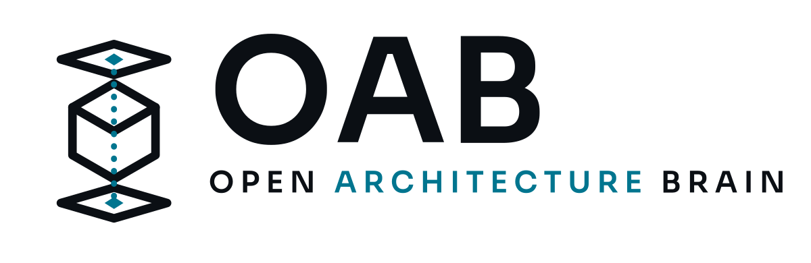

<!-- Traducción de README.md, sincronizada el 2026-08-10. El inglés es el canónico:
     al modificar README.md, actualice este archivo en el mismo cambio. -->

<picture>
  <source media="(prefers-color-scheme: dark)" srcset="assets/logo/oab-logo-on-dark.png">
  
</picture>

**Tu agente sabe cómo son los grandes sistemas. No sabe lo que necesita el tuyo.**

> Open knowledge. Open reasoning. Open architecture.

[](https://oab.run/es/)
[](LICENSE)
[](evaluations/)
[](https://github.com/mhayk/oab/releases/tag/v0.1.7)

[English](README.md) · [Português (BR)](README.pt-BR.md) · **Español**

---

## El problema

Pide a un agente de código que "diseñe una API escalable" y normalmente recibirás Kubernetes,
Kafka, Redis y tres microservicios — para un producto con 100 usuarios y un desarrollador.

El agente aprendió la *estética* del diseño de sistemas en charlas y artículos de blog, extraídos
casi por completo del 0,1% más grande de los sistemas. No aprendió la *economía*.

**100 usuarios con 40 peticiones por sesión son 0,28 peticiones por segundo.** Una sola instancia
tiene cuatro órdenes de magnitud de margen. OAB lo calcula, lo dice, y nombra la medición exacta
que cambiaría la respuesta.

## Qué hace OAB

| Comando | Lo que obtienes |
| :-- | :-- |
| `/oab:design` | Una arquitectura con los números detrás, los componentes rechazados y el umbral que cambiaría cada respuesta |
| `/oab:review` | Hallazgos calibrados por la escala a la que tu repositorio realmente funciona — no una lista prestada de un sistema mil veces mayor |
| `/oab:capacity` | Cuánto cuesta un cambio antes de hacerlo: peticiones/segundo, crecimiento de almacenamiento, egress, coste, con la fórmula impresa para comprobarla |
| `/oab:adr` | Una decisión registrada con las opciones que sopesaste y la métrica que te haría revisarla |

Una skill de fondo también se carga automáticamente, así que la conversación cotidiana sobre
arquitectura recibe la misma proporcionalidad — no solo estos cuatro comandos.

## Instalación

```
/plugin marketplace add mhayk/oab
/plugin install oab@oab
```

¿Prefieres verlo antes de instalar? **[oab.run](https://oab.run/es/)** recorre la misma decisión de
principio a fin — el brief, los números y lo que se rechaza.


Verificado de extremo a extremo: clon limpio en 0,8 s / 8,1 MB, y los ejemplos incluidos en el
repositorio contienen una ejecución real de `/oab:design` que pasa todas las aserciones de
escenario y una revisión real de un repositorio de terceros con todas las citas de evidencia
comprobadas ([`examples/live-run/`](examples/live-run/),
[`examples/live-review/`](examples/live-review/)). Una salvedad: los hooks de validación de
artefactos no se ejecutaron para plugins instalados desde el marketplace en sesiones headless
([#45](https://github.com/mhayk/oab/issues/45)); la validación a nivel de skill es el respaldo
hasta que eso se resuelva.

## Cómo se ve la salida

El corazón determinista — mismas entradas, mismos números, comprobables a mano
([`demo/`](demo/) guarda los tapes; nada está montado):


Y de [`examples/tiny-startup/`](examples/tiny-startup/) — 100 usuarios, £50/mes, dos
desarrolladores:

```
## Complexity: 4 / 4  — no headroom

| Component                    | Kind                  | Cost | Why                                    |
| Application instance         | application-runtime   |    1 | 0.28 peak RPS against a single          |
|                              |                       |      | instance leaves ~4 orders of magnitude  |
|                              |                       |      | of headroom.                            |
| Managed relational database  | relational-database   |    1 | 0.66 GB/year. Managed for tested        |
|                              |                       |      | point-in-time recovery, which a         |
|                              |                       |      | two-person team will not build.         |
```

**Qué se rechazó, y cuándo reconsiderarlo**

> **`cache`** — Con 0,24 lecturas/segundo en pico, no hay presión de lectura medida que aliviar.
> *Reconsiderar cuando: una sola consulta supere 10 peticiones/segundo por encima de 50 ms, o la
> CPU de la base de datos se mantenga por encima del 60% durante 3 días.*

> **`orchestration-platform`** — Tres veces el presupuesto de complejidad y cuatro veces el
> presupuesto económico, para un sistema con cuatro órdenes de magnitud de margen en una instancia.
> *Reconsiderar cuando: existan más de 4 servicios desplegables de forma independiente y haya un
> ingeniero de operaciones dedicado en el equipo.*

Esa segunda sección — lo que se consideró, se rechazó, y **la medición que revierte el rechazo** —
es la parte que un asistente genérico nunca produce.

## Cómo decide

Cada componente cuesta **puntos de complejidad**, y cada equipo tiene un presupuesto:

```
available = 4 + 1.5 × (engineers − 2) + 4 × dedicated_ops
```

Dos desarrolladores tienen 4 puntos. Una base de datos gestionada cuesta 1; una plataforma de
orquestación autogestionada cuesta 4. Por encima del presupuesto se **rechaza por defecto**, y una
excepción debe nombrar qué se elimina o quién operará el exceso.

A unas **£240 por punto al mes** en atención de ingeniería, autoalojar una base de datos para
ahorrar £250/mes cuesta alrededor de £720/mes. El servicio gestionado es más barato — y OAB lo dice
con aritmética, no con preferencia.

Es una heurística calibrada, no una ley — y la salida también lo dice.

## No es anti-complejidad — es anti-complejidad *injustificada*

Kubernetes, Kafka y Redis son la respuesta correcta para muchos sistemas. La pregunta es si son la
correcta para *este* — y OAB falla sus propias pruebas si se equivoca en cualquiera de las dos
direcciones.

El escenario 03 en [`evaluations/`](evaluations/) describe una plataforma a 50.000 peticiones por
segundo en tres regiones. Sus aserciones **exigen** la maquinaria que a un sistema pequeño se le
rechazaría:

```yaml
must_include_components: [cdn, cache, event-stream, application-runtime]
numeric:
  - { field: "capacity.peak_rps",             min: 40000 }
  - { field: "capacity.egress_gb_per_month",  min: 100000 }   # el egress debe calcularse
  - { field: "complexity.available",          min: 50 }
```

La suite falla si OAB rechaza event streaming a 7.500 eventos/segundo con tres grupos de
consumidores independientes, o si omite un CDN frente a 1,04 PB/mes de egress — donde un 85% de
offload ahorra unos $35.000/mes, la mayor palanca de coste de ese diseño.

**Dos de los cinco escenarios protegen contra construir de menos; tres contra construir de más.**
Una herramienta que solo evitara el exceso sería una que te dice que no hagas nada.

## Junto a otros plugins

OAB no es una metodología de desarrollo y no compite con ninguna. Los plugins de proceso como
[obra/superpowers](https://github.com/obra/superpowers) gobiernan *cómo* trabaja el agente — TDD,
debugging sistemático, planificación, review. OAB gobierna una decisión dentro de ese flujo: qué
necesita realmente *este* sistema, con la aritmética impresa. Se componen: `/oab:design` antes de
escribir un plan de implementación, `/oab:review` dentro de una pasada de revisión.

## Pruebas, no promesas

Toda afirmación de OAB es sobre comportamiento, y las afirmaciones de comportamiento sin pruebas
son marketing.

| | |
| :-- | --: |
| Escenarios pasando | **5 / 5** |
| — guardas contra construir de más | 3 / 3 |
| — guardas contra construir de menos | 2 / 2 |
| Pruebas de las calculadoras | 43 |
| Fixtures de esquema (en ambos sentidos) | 33 |
| Unidades de conocimiento | 37 |


Las aserciones se ejecutan contra **campos del artefacto**, nunca contra prosa — un framework puede
ajustarse para producir palabras tranquilizadoras con mucha más facilidad que la estructura
correcta. Los escenarios también se perturban a 100× y 0,01× para demostrar que responden a la
magnitud en lugar de reconocer números concretos.

El escenario 07 es *"no hay que cambiar nada"*, y el escenario 08 es *"estos requisitos son
inconsistentes"*. Son las respuestas que un asistente ansioso nunca da.

## Qué no está construido todavía

Lista honesta: sin servidor MCP · sin generación del grafo de conocimiento · sin segunda
integración · `/oab:evolve` y los otros nueve comandos son M2 · ningún sitio más allá de una
landing page · 6 dominios de conocimiento, no 18.

Mira el [ROADMAP.md](ROADMAP.md) y el [§32 del diseño](docs/design/07-roadmap-and-risks.md#32-overengineering-review)
— una crítica a nuestro propio brief fundacional.

## Contribuir

**La contribución de mayor valor es conocimiento de arquitectura, y no exige entender nada del
código** — copia una plantilla, rellénala, abre un pull request.

→ [docs/contributing/knowledge.md](docs/contributing/knowledge.md)

Engine, integraciones y evaluación: [CONTRIBUTING.md](CONTRIBUTING.md).

## Apoyo

OAB es gratuito, local-first, y no tiene servicio alojado que monetizar. Si se gana un lugar en tu
flujo de trabajo, [patrocinar](https://github.com/sponsors/mhayk) financia la parte sin glamur:
mantener 37 unidades de conocimiento revisadas y al día, las ejecuciones de evaluación y el
dominio.

## Licencia

[Apache-2.0](LICENSE). El nombre y el logo de OAB son marcas y no están cubiertos por esa
licencia — mira el [NOTICE](NOTICE).

[oab.run](https://oab.run/es/) · [Propuesta de diseño](docs/design/) · [Ejemplos](examples/)
