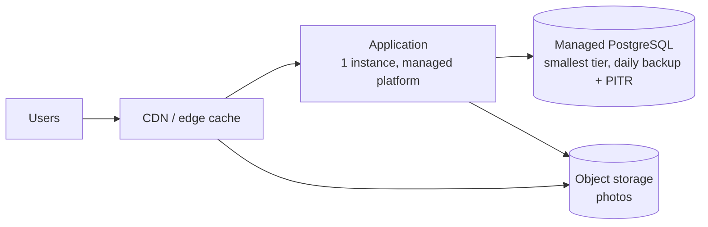
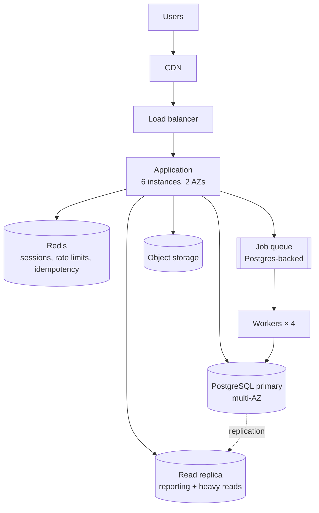

# 08 — Technology Choices & Worked Examples

Covers §33–§36 of the design brief.

---

## 33. Technology Recommendations

Each choice is justified in the format OAB requires of itself: **why, when, cost, trade-off,
failure mode, alternative, revisit condition.**

### 33.1 Markdown + YAML frontmatter — knowledge format

- **Why:** Simultaneously human-readable, agent-readable with a plain file read, diffable in review, and structured enough to validate.
- **When:** Always, for `knowledge/`, `frameworks/`, `templates/`, `docs/`.
- **Cost:** Zero runtime. Some contributor discipline to keep frontmatter valid.
- **Trade-off:** Weaker relational querying than a real graph store. Accepted: at ~200 documents, `json.load()` of a generated index is faster than any database round-trip.
- **Failure mode:** Frontmatter drifts from schema as contributions accumulate.
- **Alternative:** JSON-LD (rejected — ontology design becomes a barrier to contributing a paragraph); graph DB (rejected — requires a server to read a fact, violating local-first).
- **Revisit:** >400 units **and** measured retrieval accuracy <80% on the evaluation suite.

### 33.2 JSON Schema (draft 2020-12) — artifact contracts

- **Why:** The mechanism that converts "the agent produced text" into "the agent produced a validatable artifact". Prerequisite for deterministic evaluation. Mature tooling in every language, so future integrations validate the same contracts.
- **When:** Every structured artifact — knowledge units, capacity results, ADRs, triggers, design and review outputs.
- **Cost:** Schema authoring and maintenance; one dev-only dependency for validation.
- **Trade-off:** Verbose to author. Accepted: contracts are written once and enforced forever.
- **Failure mode:** Over-strict schemas reject legitimate contributions and drive people away.
- **Alternative:** No validation (rejected — quality regresses within 50 contributions); a custom validator (rejected — reinventing a solved problem).
- **Revisit:** If schema-rejection rate on good-faith PRs exceeds ~10%, loosen the schemas.

### 33.3 Python 3.9+, stdlib only — calculators and tools

- **Why:** Present on nearly every developer machine and every CI runner; excellent for exact arithmetic; readable by contributors who are not primarily programmers. Stdlib-only means `git clone` and run, no install step.
- **When:** `calculators/` and `tools/` only. Never a runtime requirement for reading knowledge.
- **Cost:** One language runtime in the contributor path. Windows-without-Python users lose exact calculation.
- **Trade-off:** Not distributable as a single binary. Accepted for M1.
- **Failure mode:** A contributor adds a third-party dependency and silently breaks the zero-install guarantee. Mitigation: a CI check that fails on any non-stdlib import in `calculators/`.
- **Alternative:** Node/TypeScript (viable — arguably better distribution via npx; rejected because it pulls a package manager and a lockfile into a repository that is otherwise dependency-free); Go (best distribution, worst contributor accessibility for a knowledge project); pure Markdown formulas (rejected — silent arithmetic errors are the failure mode OAB exists to prevent).
- **Revisit:** If ≥3 users report Python unavailability, or if a browser-based calculator is built, reconsider a TypeScript core compiled to both targets.

### 33.4 pytest — calculator tests

- **Why:** Standard, minimal ceremony, excellent parametrisation for the table-driven tests calculators need.
- **Cost:** One dev dependency, CI-only.
- **Trade-off:** Breaks the strict zero-dependency rule for contributors. Accepted: `unittest` would work but parametrised property tests are materially clearer in pytest, and test-only dependencies do not reach users.
- **Failure mode:** None material.
- **Alternative:** `unittest` (stdlib; acceptable fallback if the dev dependency ever becomes a problem).
- **Revisit:** Never expected.

### 33.5 GitHub + GitHub Actions — hosting and CI

- **Why:** Where the contributors are; free for public repositories; native to the plugin marketplace distribution model (`/plugin marketplace add mhayk/oab` reads a GitHub repo directly).
- **Cost:** Vendor concentration on a code-hosting platform.
- **Trade-off:** Mild tension with vendor neutrality. Accepted, and materially different in kind: the *product* has no vendor dependency; only the collaboration workflow does. The repository is a plain git repo and can move in an afternoon.
- **Failure mode:** Actions minutes exhausted by model-in-the-loop evaluations. Mitigation: Tier 2 runs on PRs touching relevant paths and nightly, not on every push.
- **Alternative:** GitLab, Codeberg (both viable; neither is where the audience is today).
- **Revisit:** If CI cost becomes material, or if GitHub policy conflicts with the open-source commitment.

### 33.6 Mermaid — diagrams

- **Why:** Text-based (diffable, agent-writable), renders natively in GitHub and in most agent clients, no toolchain.
- **When:** System context and container diagrams. Sequence diagrams for failure flows where they genuinely clarify.
- **Cost:** Zero.
- **Trade-off:** Less expressive than PlantUML/Structurizr for formal C4. Accepted: expressiveness is not the constraint; a diagram nobody can regenerate is.
- **Failure mode:** Large diagrams render poorly. Mitigation: cap at ~12 nodes; split by concern.
- **Alternative:** PlantUML (Java dependency), Structurizr (a service), D2 (promising, extra binary).
- **Revisit:** If users request formal C4 model files, add Structurizr DSL as an optional emitter.

### 33.7 Astro — oab.run

- **Why:** Content-first, Markdown-native, zero client JS by default; renders the repository's existing tree with minimal glue.
- **When:** M1 landing page; M2 full docs/knowledge rendering.
- **Cost:** A Node toolchain in `website/` only, isolated from the core.
- **Trade-off:** A JS build step in an otherwise build-free repository. Accepted because it is confined to one directory that the plugin never touches.
- **Failure mode:** Website build breaks the repository CI. Mitigation: separate workflow, separate failure domain.
- **Alternative:** Eleventy (equally good), plain HTML (viable for M1's single page and genuinely tempting), Docusaurus (heavier than needed).
- **Revisit:** If the M1 landing page is all that is ever needed, drop Astro for plain HTML.

### 33.8 Apache-2.0, semver, Keep a Changelog, DCO

- **Why:** Apache-2.0 for patent protection and enterprise acceptance (§6.1). Semver so plugin version pinning is meaningful. Keep a Changelog because plugin users need to know what changed before updating. DCO over CLA for provenance without rights assignment — important for a project claiming neutrality.
- **Cost:** Release discipline; a sign-off line per commit.
- **Trade-off:** DCO gives weaker legal protection than a CLA. Accepted: a CLA is a contribution deterrent, and rights assignment to one entity contradicts the neutrality claim.
- **Revisit:** If a foundation (e.g. CNCF, Linux Foundation) donation is ever contemplated.

### 33.9 Explicitly rejected for the foreseeable future

Databases · vector stores · graph databases · message brokers · containers as a runtime requirement ·
a hosted API · a web application · telemetry · a plugin SDK · a monorepo tool · TypeScript in the core.

Each would need an ADR with a measured requirement. None has one.

---

## 34. Example — Tiny Startup

**Input:** recipe-sharing web app · 100 registered users · 2 developers · £50/month · no stated
availability target · no compliance requirement.

### Step 1 — Assumptions (all labelled, all visible)

| Assumption | Value | Source | Confidence | Impact if wrong |
| :-- | :-- | :-- | :-- | :-- |
| Daily active share | 30% of registered | assumed | low | ±3× on RPS |
| Sessions per DAU per day | 2 | assumed | low | ±2× |
| Requests per session | 40 | assumed | medium | ±1.5× |
| Read:write ratio | 85:15 | assumed | medium | shifts DB load |
| Average record size | 2 KB | assumed | medium | ±2× on storage |
| Average response payload | 30 KB (photo-heavy) | assumed | medium | ±2× on bandwidth |
| Peak factor | 10× (single timezone, evening concentration) | assumed | medium | ±2× on peak |

### Step 2 — Capacity

```
Requests/day  = 100 × 0.30 × 2 × 40                  = 2,400 req/day
Average RPS   = 2,400 / 86,400                       = 0.028 RPS
Peak RPS      = 0.028 × 10                           = 0.28 RPS      (round up: 1 RPS)
Writes/day    = 2,400 × 0.15                         = 360 writes/day
Storage/day   = 360 × 2 KB × 2.5 (index overhead)    = 1.8 MB/day
Storage/year  = 1.8 MB × 365                         = 0.66 GB/year
Photo storage = 360 × 0.2 (photo share) × 500 KB     = 36 MB/day → 13 GB/year
Bandwidth     = 0.28 RPS × 30 KB                     = 8.4 KB/s ≈ 0.07 Mbps
Egress/month  = 0.028 × 30 KB × 2.59M s              = 2.2 GB/month
Concurrency   = L = 0.28 × 0.15 s (Little's Law)     = 0.04 concurrent requests
```

**Sensitivity:** the DAU share dominates. Even at 100% DAU and a 20× peak factor, peak RPS is
**1.9** — still under 2. *The conclusion is insensitive to every assumption in the table.* That is
the finding, and it is stronger than any individual number.

**Confidence: high** — not because the inputs are certain, but because the decision does not change
across the entire plausible input range.

### Step 3 — Stage and budget

- **Stage 1 (MVP).** Optimise for development velocity, basic reliability, low cost.
- **Complexity budget:** `4 + 1.5 × (2 − 2) + 4 × 0 = 4 points.`

### Step 4 — Options

| Option | Components | Complexity | £/month | Verdict |
| :-- | :-- | --: | --: | :-- |
| **A. Single app + managed Postgres + object storage + CDN** | 4 | **4** | £22–35 | **Selected** |
| B. Single app + SQLite on a persistent volume + CDN | 3 | 3 | £8–12 | Rejected — no managed PITR; restore is manual, untested, and a 2-person team will not test it. £15/month buys a tested recovery path. |
| C. A + Redis + read replica | 6 | 6 | £60–80 | Rejected — over budget (6 > 4) and over money budget. At 0.28 peak RPS there is no measured read pressure to relieve. |
| D. Container orchestration + microservices | 12+ | 12+ | £200+ | Rejected — 3× the complexity budget, 4× the money, for a system with 4 orders of magnitude of headroom on a single instance. |

### Step 5 — Recommended architecture



**Cost:** app £10 · Postgres £15 · object storage £2 · CDN £0 (free tier) · **total ≈ £27/month**,
leaving £23 headroom. **Complexity: 4/4 — no headroom.** Adding Redis requires removing something or
adding an engineer.

**Explicitly rejected, each with its measurement:** Kubernetes · Kafka · Redis · Elasticsearch ·
microservices · read replica · multi-region · service mesh · message queue.

### Step 6 — Reliability, honestly

No availability target was stated, so none is claimed. This architecture realistically delivers
**~99.5%** (single instance; platform restarts; managed DB maintenance windows). If 99.9% is
required, that is a different architecture and a different budget — and OAB says so rather than
quietly implying the single instance is highly available.

What is non-negotiable at *every* scale, and therefore included: automated daily backups with PITR,
**a documented and tested restore procedure**, error tracking, uptime monitoring, and explicit
timeouts on every outbound call.

### Step 7 — Triggers

| Trigger | Threshold | Action |
| :-- | :-- | :-- |
| App instance CPU | >70% sustained 1 h at peak, 3 days | Scale vertically first; re-run capacity |
| p95 response time | >800 ms for 3 days | Profile; check N+1 queries before adding infrastructure |
| Database CPU | >60% sustained 3 days | Query optimisation and indexing before a replica |
| Database storage | >60% of plan | Plan retention/archival |
| Photo storage | >100 GB | Review object storage tier and lifecycle rules |
| Registered users | >5,000 | Re-run `/oab:capacity`; assumptions no longer apply |
| Unplanned downtime | >30 min/month for 2 months | Now there is an availability requirement — design for it |

---

## 35. Example — Medium SaaS

**Input:** B2B project-management SaaS · 100,000 MAU across ~1,200 tenants · 8 engineers, no
dedicated SRE · multi-tenant · background processing (reports, integrations, notifications) ·
99.9% target · EU data residency.

### Capacity

```
DAU           = 100,000 × 0.25                            = 25,000
Requests/day  = 25,000 × 3 sessions × 60 req              = 4,500,000
Average RPS   = 4,500,000 / 86,400                        = 52 RPS
Peak RPS      = 52 × 4 (business hours, EU-concentrated)  = 208 RPS
Peak reads    = 208 × 0.90                                = 187 reads/s
Peak writes   = 208 × 0.10                                = 21 writes/s
DB queries    = 208 × 1.5 queries/request                 = 312 queries/s
Concurrency   = L = 208 × 0.08 s                          = 17 in-flight requests
DB concurrency= L = 312 × 0.004 s                         = 1.25 concurrent queries
Inserts/day   = 450,000 writes × 20% insert share         = 90,000
Storage/day   = 90,000 × 1.5 KB × 2.5                     = 338 MB/day
Storage/year  =                                            = 123 GB/year
Egress/month  = 52 RPS × 25 KB × 2.59M s                  = 3.4 TB/month
Background    = 200,000 jobs/day, mean 0.8 s
Workers       = ceil(2.3 jobs/s × 0.8 s / 0.7 utilisation) = 3 → provision 4
```

### The decisions the numbers make for you

**21 writes/s is not a scaling problem.** A single Postgres primary handles this with three orders
of magnitude of headroom. Any recommendation to shard, or to adopt a distributed database, is
unjustified and would be rejected.

**Connection pool arithmetic rejects PgBouncer.** 6 app instances × pool of 10 = 60 connections
against a default max of 100–200. Measured concurrent query demand is 1.25. A connection pooler is a
component with no problem to solve *yet* — trigger it at >80% of `max_connections`.

**Redis is justified — but not as a cache.** The cache case is marginal (a 60% hit rate on 187
reads/s removes 112 q/s from a database doing 312 q/s comfortably). The real justification is
**shared state across 6 instances**: session storage, per-tenant rate limiting, and idempotency keys
cannot live in process memory across a horizontally-scaled fleet. Stating the true reason matters,
because it determines the failure behaviour to design for: if Redis fails, rate limiting must fail
*open* and sessions must degrade to re-login, not to a total outage.

**Kafka is rejected.** 21 writes/s and 2.3 jobs/s. A Postgres-backed job queue (or the platform's
managed queue) handles this with room to spare and costs one component instead of an operational
discipline. Trigger for revisit: sustained >500 events/s, or a genuine need for multiple independent
consumer groups replaying the same stream.

**Multi-tenancy: shared database, shared schema, `tenant_id` on every table, enforced by row-level
security.** 1,200 tenants makes database-per-tenant an operational catastrophe (1,200 migrations,
1,200 backup verifications) for a team with no SRE. Trigger for revisit: a tenant requires physical
isolation for compliance, or the largest tenant exceeds ~15% of total load (noisy-neighbour risk),
at which point that tenant alone moves to a dedicated database.

### Architecture



### Budget and cost

**Complexity budget:** `4 + 1.5 × 6 + 0 = 13 points.`
**Spent: 9** — app 1 · workers 1 · Postgres 1 · replica 1 · Redis 2 (managed + new datastore
technology) · object storage 1 · CDN 1 · observability 1. **4 points of headroom** — enough to
absorb one significant addition without a rethink.

| Line | £/month |
| :-- | --: |
| App instances (6) | 240 |
| Workers (4) | 100 |
| Postgres primary (multi-AZ) | 250 |
| Read replica | 250 |
| Redis (managed, 2 GB) | 60 |
| Object storage (2 TB) | 40 |
| CDN + egress (3.4 TB, 70% offload) | 150 |
| Observability | 200 |
| Backups | 30 |
| **Infrastructure** | **≈ 1,320** |
| **Operational** (9 points × ~£240) | **≈ 2,160** |
| **Total cost of architecture** | **≈ £3,500/month** |

The operational line is larger than the infrastructure line. That is the normal case at this size,
it is invisible in every cloud calculator, and it is the reason self-hosting to save £250 on the
managed database would be a **£470/month loss**.

### 99.9% check

43 minutes of downtime per month. Achievable here: multi-AZ database with automated failover,
multiple app instances behind health checks, rolling deploys, tested restores. **Not** achievable
would be 99.99% — that needs sub-minute automated failover with no human step, and this design has
manual steps in its recovery path. OAB states the ceiling rather than letting the target be assumed.

---

## 36. Example — Large-Scale System

**Input:** consumer content platform · 50,000 RPS average · multi-region (EU, US, APAC) · 99.99%
target · 40 engineers including 4 SRE.

### Capacity

```
Requests/day   = 50,000 × 86,400                       = 4.32 billion
Peak RPS       = 50,000 × 1.5 (global smoothing)       = 75,000
Concurrency    = L = 75,000 × 0.05 s                   = 3,750 in-flight requests
CPU demand     = 75,000 × 8 ms                         = 600 cores at 100%
Instances      = 600 / 0.60 target util / 8 vCPU       = 125 → 150 with AZ-failure headroom
Peak reads     = 75,000 × 0.90                         = 67,500 reads/s
Peak writes    = 75,000 × 0.10                         = 7,500 writes/s
Egress         = 50,000 × 8 KB × 2.59M s               = 1.04 PB/month
Storage/day    = 7,500 × 86,400 × 500 B × 2.5          = 810 GB/day → 296 TB/year
```

### Where the money actually is

```
Egress, origin-served at $0.05/GB   : 1.04 PB      → $51,800/month
Egress, 85% CDN offload at $0.01/GB : 156 TB × 0.05 + 884 TB × 0.01
                                                    → $16,640/month
                                       Saving       → $35,000/month
```

**The single highest-value architectural decision at this scale is CDN offload, and it is a
bandwidth arithmetic result, not an architectural fashion.** It is worth more per month than the
entire compute fleet of the medium-SaaS example. A design review that starts with the service
topology and never computes egress has missed the largest line on the invoice.

### Where the numbers now *do* justify distributed machinery

This is the case OAB must handle without flinching. Proportionality means saying yes when the
numbers say yes.

| Component | Justification from the numbers |
| :-- | :-- |
| **Distributed cache cluster** | 67,500 reads/s cannot reach the database. At a 95% hit rate, 3,375 reads/s reach 5 replicas = 675/s each — feasible. The cache is now on the critical path, so it needs its own availability design (replication, and a defined behaviour when a shard is lost). |
| **Write-path partitioning** | 7,500 writes/s exceeds a single Postgres primary's comfortable sustained range for an indexed workload. Partition by entity key, or move the highest-volume append-only stream (events, activity) to a store designed for it. This is the first genuinely one-way door in the design and gets its own ADR. |
| **Event streaming** | 7,500 events/s with ≥3 independent consumer groups (search indexing, analytics, notifications) that must replay independently. This is the workload Kafka exists for. Partition count: `7,500 / 500 msg/s per consumer = 15 minimum → 48` for growth and rebalance headroom. |
| **Multi-region** | 99.99% (53 min/year) with a stated APAC user base. Single-region cannot meet the latency requirement for APAC, and regional failure alone would consume the annual error budget. Multi-region here is a *requirement*, not an aspiration. |
| **Cell-based isolation** | At 4.3 billion requests/day, blast radius is the dominant reliability concern. Partitioning users into independently-deployable cells caps the impact of any single failure or bad deploy. |

### Where the numbers still say no

Even at this scale, OAB refuses things that do not have a measurement behind them:

- **Multi-region active-active for the primary transactional store** — unless a specific
  requirement demands cross-region write availability. Active-passive with regional read replicas
  meets 99.99% at a fraction of the consistency complexity. Multi-master conflict resolution is a
  permanent tax on every future feature.
- **Microservices per team** — service boundaries follow failure isolation and scaling
  requirements, not the org chart. Components with identical scaling profiles and a shared
  transactional boundary stay together.
- **A second search technology** — if Postgres full-text meets the query requirements for a given
  surface, the second engine costs 3 complexity points and a synchronisation pipeline whose
  inconsistency will become a support ticket.

### Budget

**Complexity budget:** `4 + 1.5 × 38 + 4 × 4 = 77 points.` A design of this shape spends roughly
25–30. **Complexity is not the binding constraint at this scale** — cost and blast radius are. The
budget model correctly stops being the interesting question, which is the right behaviour for a
heuristic: it must bind where it matters and get out of the way where it does not.

### Performance targets and the test that proves them

```
Steady state @ 75,000 RPS : p50 < 40 ms · p95 < 200 ms · p99 < 500 ms
                            error rate < 0.1% · CPU < 65% · cache hit > 93%
Stress                    : ramp to 150,000 RPS; locate the knee (p99 > 2× steady)
                            requirement: knee ≥ 2× peak
Spike                     : 3× step for 60 s; graceful degradation via load shedding,
                            not cascading failure; recovery to baseline < 120 s
Regional failure          : drain one region; requirement — remaining regions absorb
                            the load within the error budget, failover < 60 s, no manual step
Soak                      : 8 h at 70% of knee; memory growth < 3%; p95 drift < 10%
```
