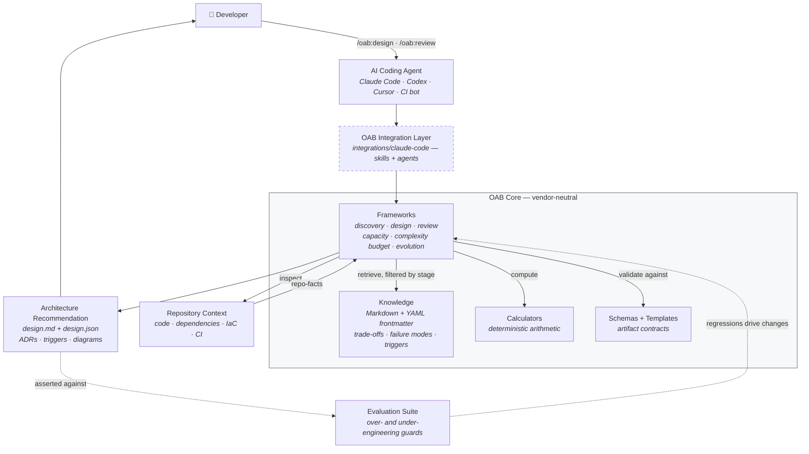
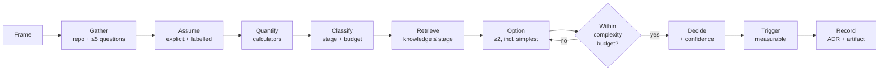

# 09 — Specifications

Covers §37–§42 of the design brief.

---

## 37. Repository Tree

The M1 tree. Directories that would be empty at M1 are **not** created — an empty directory is a
promise, not an architecture.

```
oab/
├── README.md
├── LICENSE                              # Apache-2.0
├── NOTICE
├── CONTRIBUTING.md
├── CODE_OF_CONDUCT.md
├── SECURITY.md
├── CHANGELOG.md
├── ROADMAP.md
│
├── .claude-plugin/
│   ├── marketplace.json                 # this repo is also the marketplace
│   └── plugin.json                      # name: "oab"  →  /oab:* namespace
│
├── .github/
│   ├── workflows/
│   │   ├── validate.yml                 # schemas, links, neutrality lint, plugin validate
│   │   ├── test.yml                     # calculator unit + property tests
│   │   └── evaluate.yml                 # Tier 2 scenarios (gated on a secret; nightly + paths)
│   ├── ISSUE_TEMPLATE/
│   │   ├── knowledge-contribution.yml
│   │   ├── bug-report.yml
│   │   ├── framework-change.yml
│   │   └── config.yml
│   └── pull_request_template.md
│
├── knowledge/                           # THE DURABLE ASSET — vendor-neutral
│   ├── README.md                        # how to read and contribute knowledge
│   ├── fundamentals/
│   │   ├── README.md                    # generated domain index
│   │   ├── maturity-stages.md
│   │   ├── complexity-cost.md
│   │   ├── proportional-architecture.md
│   │   ├── little-law.md
│   │   ├── utilisation-and-queueing.md
│   │   └── tail-latency.md
│   ├── databases/
│   │   ├── README.md
│   │   ├── relational-vs-document.md
│   │   ├── indexing-fundamentals.md
│   │   ├── connection-pooling.md
│   │   ├── read-replicas.md
│   │   ├── partitioning-and-sharding.md
│   │   ├── transactions-and-mvcc.md
│   │   ├── schema-migration-safety.md
│   │   └── backup-restore-and-pitr.md
│   ├── caching/
│   │   ├── README.md
│   │   ├── when-not-to-cache.md         # deliberately first-class
│   │   ├── cache-aside.md
│   │   ├── ttl-and-invalidation.md
│   │   ├── cache-stampede.md
│   │   └── cache-sizing.md
│   ├── messaging/
│   │   ├── README.md
│   │   ├── sync-vs-async-decision.md
│   │   ├── database-backed-queues.md
│   │   ├── delivery-guarantees.md
│   │   ├── idempotency.md
│   │   ├── transactional-outbox.md
│   │   ├── dead-letter-queues.md
│   │   └── when-you-need-streaming.md
│   ├── reliability/
│   │   ├── README.md
│   │   ├── availability-targets.md
│   │   ├── timeouts.md
│   │   ├── retries-backoff-jitter.md
│   │   ├── circuit-breakers.md
│   │   ├── bulkheads.md
│   │   ├── graceful-degradation.md
│   │   └── failure-mode-analysis.md
│   └── cost/
│       ├── README.md
│       ├── operational-cost-model.md
│       ├── egress-cost.md
│       ├── managed-vs-self-hosted.md
│       └── observability-cost.md
│
├── frameworks/                          # PROCEDURES — vendor-neutral
│   ├── README.md
│   ├── discovery/procedure.md
│   ├── architecture-design/procedure.md
│   ├── architecture-review/procedure.md
│   ├── capacity-planning/procedure.md
│   ├── complexity-budget/
│   │   ├── procedure.md
│   │   └── weights.yaml                 # data, so it can be argued about in a PR
│   └── evolution-triggers/
│       ├── procedure.md
│       └── trigger-library.md           # generated from knowledge frontmatter (M2)
│
├── calculators/                         # DETERMINISTIC ARITHMETIC — stdlib only
│   ├── README.md
│   ├── pyproject.toml                   # metadata only; no runtime dependencies
│   ├── oab_calc/
│   │   ├── __init__.py
│   │   ├── __main__.py                  # python3 -m oab_calc rps --requests-per-day=2400
│   │   ├── rps.py
│   │   ├── storage.py
│   │   ├── bandwidth.py
│   │   ├── concurrency.py
│   │   ├── connections.py
│   │   ├── cache.py
│   │   ├── queue.py
│   │   ├── cost.py
│   │   └── result.py                    # the common Assumptions/Formula/Result envelope
│   └── tests/
│
├── schemas/                             # CONTRACTS
│   ├── knowledge-unit.schema.json
│   ├── capacity-result.schema.json
│   ├── adr.schema.json
│   ├── evolution-trigger.schema.json
│   ├── design-output.schema.json
│   ├── review-output.schema.json
│   ├── review-finding.schema.json
│   ├── repo-facts.schema.json
│   └── reasoning-trace.schema.json
│
├── templates/
│   ├── adr.md
│   ├── architecture-review.md
│   ├── system-design.md
│   ├── capacity-report.md
│   └── knowledge-unit.md                # what a contributor copies
│
├── evaluations/
│   ├── README.md
│   ├── scenarios/
│   │   ├── 01-tiny-startup/{scenario.yaml,assertions.yaml,notes.md}
│   │   ├── 02-growing-saas/
│   │   ├── 03-large-platform/
│   │   ├── 07-no-change-needed/
│   │   └── 08-inconsistent-requirements/
│   ├── holdout/                         # not referenced by any framework
│   └── runner/
│       ├── run_scenarios.py
│       └── assertions.py
│
├── integrations/                        # THE ONLY VENDOR-AWARE ZONE
│   └── claude-code/
│       ├── README.md
│       ├── skills/
│       │   ├── design/SKILL.md
│       │   ├── review/SKILL.md
│       │   ├── capacity/SKILL.md
│       │   ├── adr/SKILL.md
│       │   └── principles/SKILL.md      # user-invocable: false
│       └── agents/
│           └── repo-scanner.md
│
├── examples/
│   ├── tiny-startup/{design.md,design.json,README.md}
│   ├── medium-saas/
│   └── repo-review/
│
├── docs/
│   ├── getting-started.md
│   ├── principles.md
│   ├── design/                          # this proposal
│   ├── architecture/                    # OAB's own architecture + ADRs (dogfooding)
│   │   └── adr/
│   ├── contributing/{knowledge.md,engine.md,style.md,review-checklist.md}
│   ├── frameworks/
│   ├── reference/{commands.md,schemas.md,calculators.md}
│   └── maintainers/{release.md,knowledge-review.md}
│
├── tools/
│   ├── validate_knowledge.py            # frontmatter + referential integrity
│   ├── validate_artifacts.py
│   ├── check_neutrality.py              # no vendor names outside integrations/
│   ├── check_stdlib_only.py
│   ├── check_price_staleness.py
│   └── build_index.py                   # domain READMEs (M1); graph (M2)
│
└── website/                             # oab.run — M1: one page
    └── ...
```

---

## 38. Claude Commands (M1)

Four commands plus one background skill. Each is `integrations/claude-code/skills/<name>/SKILL.md`.

### `/oab:design` — design a system

```yaml
---
name: design
description: >-
  Design a system architecture proportional to its actual requirements. Quantifies scale,
  computes capacity, applies a complexity budget, generates options with explicit rejections,
  and produces ADRs with measurable revisit triggers.
argument-hint: "[brief description of the system]"
disable-model-invocation: true
allowed-tools: Read Grep Glob Bash(python3 ${CLAUDE_PLUGIN_ROOT}/calculators/*)
---
```

**Procedure (Tier-1 body, ~150 lines):** frame the problem → inspect the repository if one exists →
ask at most 5 high-impact questions → state assumptions → run capacity calculators → classify stage
and compute the complexity budget → retrieve knowledge filtered by `applies_at_stage` → generate
≥2 options including the simplest viable → apply the budget → decide → define triggers → emit
`docs/architecture/design.md` **and** `.oab/design.json`.

**Adaptive output:** executive summary always; other sections only where they have content. A
stage-1 system does not get a partitioning section.

### `/oab:review` — review an existing repository

```yaml
---
name: review
description: >-
  Review the architecture of the current repository. Inventories what exists, establishes the
  system's actual operating scale, and reports findings weighted by that scale — never
  theoretical problems.
argument-hint: "[optional: path or area to focus on]"
disable-model-invocation: true
allowed-tools: Read Grep Glob
---
```

Delegates inventory to the `oab:repo-scanner` subagent (returns `repo-facts`), establishes context
(≤3 questions, assume small when unknown), analyses, assigns scale-weighted severity, emits
`docs/architecture/review.md` and `.oab/review.json`.

### `/oab:capacity` — capacity planning

```yaml
---
name: capacity
description: >-
  Capacity planning with explicit assumptions, formulas, and reproducible arithmetic. Computes
  RPS, storage growth, bandwidth, concurrency, connection demand, cache sizing, worker counts,
  and cost — with safety margins, ranges, and a sensitivity analysis.
argument-hint: "[what to size, e.g. 'API for 50k users' or '5x traffic spike']"
allowed-tools: Bash(python3 ${CLAUDE_PLUGIN_ROOT}/calculators/*)
---
```

Model-invocable: cheap, read-only, and high value when Claude notices a sizing question in an
ordinary conversation.

### `/oab:adr` — architecture decision record

```yaml
---
name: adr
description: >-
  Create or review an Architecture Decision Record with options, trade-offs, consequences,
  migration path, required observability, and measurable revisit conditions.
argument-hint: "[decision title]"
---
```

Auto-numbers into `docs/adr/`, requires ≥2 options and ≥1 measurable trigger, validates against
`adr.schema.json`.

### `oab-principles` — background skill

```yaml
---
name: oab-principles
description: >-
  Core architecture reasoning principles: proportionality to measured scale, operational
  complexity as a first-class cost, quantify before deciding, and measurable revisit triggers.
  Use whenever architecture, system design, scaling, infrastructure choices, or technology
  selection are being discussed.
user-invocable: false
---
```

The highest-leverage element of the integration: it improves *ordinary* architecture conversation,
not just explicit commands. Kept under 80 lines so it is cheap to load.

### Deferred commands, and why

`scale` · `performance` · `reliability` · `security` · `cost` · `diagram` · `evolve` · `explain` ·
`knowledge` — all are slices of, or extensions to, the four above. Shipping nine thin commands
before two good ones is how a plugin becomes a menu nobody understands. Usage decides which are
promoted in M2. `/oab:evolve` is the most likely first addition because it is the retention
mechanism.

---

## 39. Knowledge Schema Example

`knowledge/caching/cache-stampede.md`

```markdown
---
id: cache-stampede
title: Cache Stampede
description: >-
  When a popular cache entry expires, concurrent requests all miss simultaneously and
  overwhelm the origin with duplicate work.
category: caching
subcategory: failure-modes
tags: [cache, thundering-herd, concurrency, resilience]
maturity: stable
confidence: high
applies_at_stage: ["2", "3", "4", "5"]
prerequisites: [cache-aside, ttl-and-invalidation]
related: [thundering-herd, request-coalescing, circuit-breakers]
complexity_cost: 1
trade_offs:
  - gains: "Bounded origin load when hot keys expire"
    costs: "Added coordination; a lock adds a failure mode of its own"
    when_worth_it: "Any cached item whose recomputation costs >100 ms and is requested >10×/s"
failure_modes:
  - mode: "Synchronised expiry across many keys"
    symptom: "Periodic origin load spikes at regular intervals matching the TTL"
    detection: "Origin request rate showing periodicity at the TTL boundary"
    mitigation: "Randomised TTL jitter of ±10–20%"
  - mode: "Lock holder fails mid-recompute"
    symptom: "All requests block until the lock expires; latency cliff"
    detection: "p99 latency spikes correlated with cache misses"
    mitigation: "Bounded lock TTL plus serve-stale-while-revalidate"
triggers:
  - metric: "origin.requests_per_second"
    comparator: ">"
    threshold: 10
    unit: "requests/second for a single cache key"
    window: "sustained 5 minutes"
    action: "Introduce request coalescing or probabilistic early expiry for this key"
anti_patterns:
  - "Setting identical TTLs across a whole key class"
  - "Adding a distributed lock before measuring whether stampede actually occurs"
references:
  - title: "Optimal Probabilistic Cache Stampede Prevention"
    author: "Vattani, Chierichetti, Lowenstein"
    type: paper
    accessed: 2026-08-09
  - title: "Caching at scale"
    type: engineering-blog
    accessed: 2026-08-09
last_reviewed: 2026-08-09
---

## What it is

A cache stampede (or dog-piling) happens when a frequently-requested cache entry expires and
many concurrent requests miss at the same instant. Every one of them recomputes the same value
against the origin, converting a cache hit rate of 99% into a momentary hit rate of 0% at the
exact moment of highest demand.

## When it applies

Three conditions must hold together. If any is absent, this is not your problem:

1. Request rate for a **single key** exceeds roughly 10/s.
2. Recomputation cost exceeds ~100 ms.
3. The cache uses hard expiry rather than serve-stale-while-revalidate.

## When it does not apply

- Low-traffic systems. At 1 request/second for a key, a stampede is two duplicate queries.
- Keys with naturally staggered expiry (per-user caches written at different times).
- Caches that already serve stale content while revalidating — the pattern is prevented by
  construction, which is why it is the preferred default.

## How it works

...

## Trade-offs

...

## Failure modes

...

## Measurement

Instrument origin request rate per cache key class and correlate with TTL boundaries.
Periodicity matching the TTL is the signature. Without this measurement, mitigation is
speculative and adds complexity for an unconfirmed problem.

## Alternatives

| Approach | Complexity | When to prefer |
| :-- | --: | :-- |
| TTL jitter (±10–20%) | 0 | Always. Free, no coordination, prevents synchronised expiry. |
| Serve stale while revalidating | 1 | When slightly stale data is acceptable — the best default. |
| Request coalescing / single-flight | 1 | Single-instance or per-instance deduplication. |
| Distributed lock | 2 | Only when recomputation is genuinely expensive and cross-instance duplication is unacceptable. |
| Probabilistic early expiry | 1 | High-traffic keys where a lock's failure modes are unwelcome. |

## References

...
```

---

## 40. ADR Schema Example

`docs/adr/0007-job-queue-selection.md`

```markdown
---
id: ADR-0007
title: Use a PostgreSQL-backed job queue rather than a dedicated broker
status: accepted
date: 2026-08-09
deciders: [platform-team]
supersedes: []
superseded_by: null
tags: [messaging, async, infrastructure]
complexity_delta: 0
monthly_cost_delta_gbp: 0
reversibility: easy
confidence: high
triggers: [queue-throughput-limit, queue-backlog-drain, consumer-group-requirement]
---

# ADR-0007 — Use a PostgreSQL-backed job queue rather than a dedicated broker

## Status
Accepted — 2026-08-09

## Context
The application needs asynchronous processing for report generation, third-party
integration sync, and notification delivery. Current measured volume is 200,000 jobs/day
(2.3 jobs/s mean, ~9 jobs/s peak) with a mean service time of 0.8 s. The team is 8
engineers with no dedicated SRE. PostgreSQL is already in the architecture and operated.

## Requirements
- R1: At-least-once delivery with idempotent consumers.
- R2: Retry with backoff; a dead-letter path after 5 attempts.
- R3: Job visibility for support (inspect, requeue, cancel).
- R4: Sustain 50 jobs/s peak (5× current) without redesign.
- R5: Transactional consistency between business writes and job enqueue.

## Constraints
- No dedicated operations capacity for a new stateful system.
- Complexity budget: 13 points, 9 already committed.
- Existing PostgreSQL expertise in the team; no broker expertise.

## Options Considered

### Option A — PostgreSQL-backed queue (SKIP LOCKED)
Gains: zero new components; R5 satisfied by construction (enqueue in the same transaction
as the business write, eliminating the dual-write problem); jobs inspectable with SQL;
existing backup and monitoring cover it.
Costs: consumes database connections and I/O; throughput ceiling in the low thousands/s;
requires care with long-running transactions and index bloat.
Complexity: 0 · Monthly cost: £0 · Reversibility: easy

### Option B — Managed queue service
Gains: independent scaling; no database load; managed durability.
Costs: +2 complexity (new managed service + new technology); dual-write problem between
the database and the queue must be solved by an outbox anyway; a second system to inspect
during support incidents.
Complexity: 2 · Monthly cost: ~£25 · Reversibility: easy

### Option C — Kafka
Gains: very high throughput; replay; independent consumer groups.
Costs: +3–4 complexity; no team expertise; operational burden with no SRE; solves a
throughput problem three orders of magnitude beyond measured demand.
Complexity: 4 · Monthly cost: ~£400 · Reversibility: hard

## Decision
Option A — a PostgreSQL-backed job queue using `SELECT ... FOR UPDATE SKIP LOCKED`.

## Rationale
Measured demand is 2.3 jobs/s mean and ~9 jobs/s peak. A PostgreSQL queue on the existing
instance sustains hundreds of jobs/s, giving more than an order of magnitude of headroom
against R4. R5 is the decisive requirement: enqueueing in the same transaction as the
business write eliminates the dual-write problem that Options B and C would reintroduce and
that would have to be solved with a transactional outbox — adding back the complexity the
external broker was supposed to avoid. Neither B nor C solves a problem we have.

## Trade-offs Accepted
- Queue load shares database capacity with application queries; the queue is now a
  consideration in database sizing.
- A hard throughput ceiling exists, roughly two orders of magnitude above current demand.
- No native multi-consumer-group replay. Not currently required.

## Consequences
- Job tables need a retention policy; completed jobs are archived after 30 days.
- Database connection pool sizing must account for worker connections (4 workers × 5).
- Long-running jobs must not hold a transaction open; the claim and the work are separate
  transactions.
- Monitoring must include queue depth and oldest-job age as first-class metrics.

## Migration Path
If a trigger fires, migration is incremental: introduce the new broker for one job class,
run both in parallel, verify, then move remaining classes. The job interface is abstracted
behind an `enqueue(job)` port so consumers do not change. Estimated 2–3 weeks.

## Observability
- `queue.depth` by job class — alert at >1,000 sustained 10 minutes
- `queue.oldest_job_age_seconds` — alert at >300 s
- `queue.throughput_jobs_per_second`
- `queue.failure_rate` and DLQ depth — alert on any DLQ growth
- `job.duration` p50/p95/p99 by class

## Revisit Conditions
See triggers `queue-throughput-limit`, `queue-backlog-drain`, `consumer-group-requirement`
in §41.
```

---

## 41. Evolution Trigger Schema

`schemas/evolution-trigger.schema.json` (informal shape; the JSON Schema is normative)

```yaml
id: queue-throughput-limit          # unique, kebab-case
decision: ADR-0007                  # the decision this trigger guards
metric: queue.throughput_jobs_per_second
source: "application metrics — queue dashboard"   # WHERE it is read; no source ⇒ not a trigger
comparator: ">"                     # > | >= | < | <= | == | !=
threshold: 200
unit: jobs/second
window: "sustained over 3 consecutive days at peak hour"
action: "Re-run /oab:capacity for the async subsystem; evaluate broker options against
         measured demand and consumer-group requirements"
owner: "platform-team"
verification: "monthly — confirm the metric is still emitted and the threshold still meaningful"
status: armed                       # armed | fired | resolved | retired
created: 2026-08-09
fired_at: null
notes: >-
  Threshold set at ~20× current peak (9 jobs/s) and well below the measured PostgreSQL
  queue ceiling, so it fires with time to act rather than during an incident.
```

Companion triggers for the same decision:

```yaml
- id: queue-backlog-drain
  decision: ADR-0007
  metric: queue.oldest_job_age_seconds
  source: "application metrics"
  comparator: ">"
  threshold: 900
  unit: seconds
  window: "after a normal traffic spike has passed, twice in one month"
  action: "Increase worker count; if workers are already CPU-bound, re-evaluate the queue substrate"
  owner: platform-team
  status: armed

- id: consumer-group-requirement
  decision: ADR-0007
  metric: "count of independent consumers requiring replay of the same job stream"
  source: "architecture review — quarterly"
  comparator: ">="
  threshold: 3
  unit: consumer groups
  window: "confirmed requirement, not anticipated"
  action: "Evaluate event streaming; this is the requirement a broker genuinely satisfies"
  owner: platform-team
  status: armed
```

### Validity rules (schema-enforced)

| Rule | Enforcement |
| :-- | :-- |
| `source` non-empty and names a real place | Schema `minLength`; review |
| `window` present — no instantaneous triggers | Required field |
| `action` starts with a verb and is a *next step*, not a solution | Review checklist |
| `owner` present | Required field |
| Numeric `threshold` with an explicit `unit` | Schema types |
| `status` transitions are recorded, not overwritten | `fired_at` retained |

---

## 42. System Diagram

### Runtime flow



The dashed border on the integration layer is the architectural claim: it is replaceable. A second
integration attaches at the same boundary, and the core is untouched.

### Reasoning flow inside a single command



The loop at the budget gate is the mechanism. An option set that cannot fit the budget sends the
agent back to generate simpler options rather than forward to justify an expensive one.
