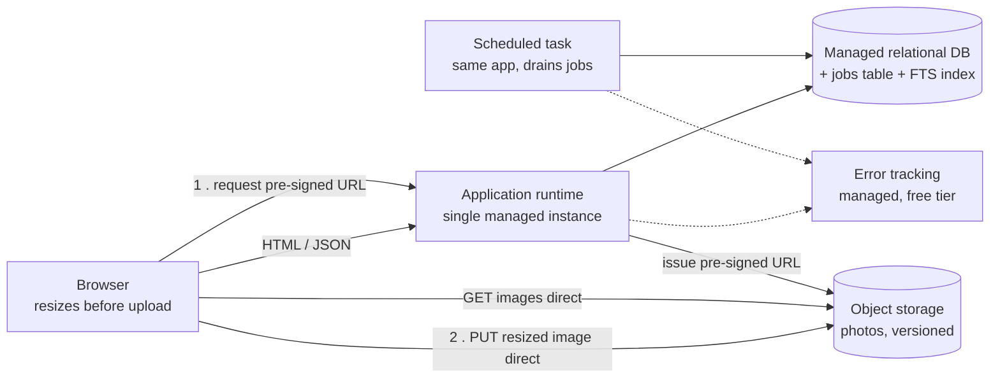

# Recipe sharing web app — Architecture

**Stage 1 (MVP)** · 100 registered users · 2 developers · £50/month · generated 2026-08-09 · OAB 0.1.0

---

## Executive summary

Four managed components: **one application instance, one managed relational database, one object storage bucket, and error tracking.** No CDN, no cache, no queue, no worker, no search engine, no load balancer.

The framing question is not "how do we build a scalable photo-sharing platform" — it is "which datastore and which deployment target for something small, and where do the photos go". The photo requirement is what makes this brief feel like it needs a media pipeline. The arithmetic says otherwise:

| What it feels like it needs | What the numbers say | Threshold it would need to cross |
| :-- | :-- | :-- |
| CDN for photos | **3.9 GB/month** of origin egress, costing £0.16–0.35 | ~1 TB/month |
| Cache for the browse page | hottest key at **0.081 req/s**; a cache would remove **0.041 queries/s from a database doing 1.4** | ~10 req/s on a single key |
| Queue + worker for image resizing | **0.00023 jobs/second** — 20 photos a day | ~500 jobs/s for a broker |
| Second instance behind a load balancer | peak **0.28 req/s**, ~3% of one instance | 70% CPU on one instance |

Peak traffic is **0.28 requests/second**. At the extreme end of every plausible assumption — 100% of users active daily, three sessions each of sixty requests, a 20× peak factor — it is **4.2 requests/second**. That is a 450× range, and one small instance handles all of it. The recommendation does not change anywhere in the input range, which is a stronger finding than the point estimate.

**The one non-obvious design move:** resize photos **in the browser** and PUT them straight to object storage via a short-lived pre-signed URL. This costs zero complexity points, cuts the mobile upload payload from 3 MB to 200 KB — the slowest part of publishing a recipe — and keeps image decoding of untrusted input out of the server process entirely. It is what removes the worker and the queue from the design rather than merely arguing them down.

```
Complexity: 4 / 4 — no headroom. Adding a CDN, a cache, a queue or a
dedicated worker requires removing something or adding an engineer.
```

**The headline trade-off:** operational cost is **£960/month** against an infrastructure bill of **£16–56/month** — roughly 25× larger, and invisible in every cloud pricing calculator. That single ratio is why the cheapest-invoice option (self-hosting everything on one VM, £15–25) is the most expensive architecture on the table, at about £950/month more once the four extra complexity points are priced.

**No availability target was stated and none has been invented.** This architecture delivers about **99.5%**. Reaching 99.9% needs a second instance and a database that fails over, putting infrastructure at £150–250/month — three to five times the stated budget. That is a budget decision, not an architecture one, and it should be made deliberately rather than discovered.

---

## Assumptions

Every gap is here, with a confidence and the impact if wrong, so you can correct an input rather than distrust the analysis. **You asked me not to ask questions, so all fourteen gaps below became labelled assumptions.** The ones that would actually change the design are flagged.

| # | Assumption | Confidence | Impact if wrong |
| :-- | :-- | :-- | :-- |
| 1 | 30% of registered users are daily active | low | ±3× on RPS. Changes no component. |
| 2 | 2 sessions/day, 40 requests/session | low | Linear on RPS and egress. Changes no component. |
| 3 | Peak factor 10 (single-timezone consumer; a cooking app concentrates late afternoon and evening) | medium | Direct multiplier on provisioning. At 20× it is 0.56 req/s. |
| 4 | 95% reads / 5% writes | medium | Sets writes at 0.014/s. Would need to invert by three orders of magnitude to matter. |
| 5 | 200 recipes/month across all users, 3 photos each → 20 photos/day | low | Drives storage growth and job volume. At 10× both are still comfortable. |
| 6 | Photos are 3 MB phone originals; served derivatives ~200 KB and ~30 KB | medium | Dominates storage and egress. Negligible cost either way. |
| 7 | Recipes and photos are **public** — no per-user access control on media | medium | ⚠️ Private media means short-lived signed URLs for every image request. Application work, not a new component. |
| 8 | Audience is single-timezone (UK), consistent with a GBP budget | medium | Sets the peak factor; rules out multi-region. |
| 9 | The two developers have operated a managed relational database and a managed app platform before | medium | ⚠️ If false, +1 point per unfamiliar component and the design is immediately over budget. |
| 10 | User recipes and photos are irreplaceable | high | Makes backups, PITR and object versioning unconditional rather than proportional to traffic. |
| 11 | The platform runs a scheduled task from the same deployment as the web process, without billing a separate always-on process | medium | ⚠️ **If false this is 5/4 — over budget.** The highest-value question to settle before picking a platform. |
| 12 | The smallest managed relational plan offers point-in-time recovery, not snapshot-only | low | ⚠️ RPO of minutes vs up to 24 hours for irreplaceable content. A plan-selection criterion. |
| 13 | No compliance constraints, as none were stated | medium | ⚠️ If the audience is UK/EU, data protection law applies to stored emails and user content regardless. Bounded consequence, but not zero. |
| 14 | One small managed instance sustains **at least 10 req/s** for this workload | low | ⚠️ **The load-bearing assumption of the whole design.** Deliberately conservative; sets the 2,500-user trigger. Measure this first. |

---

## Capacity

Computed by hand from the formulas in `calculators/README.md`. **`python3` execution was unavailable in this environment, so the calculators were not run** — the arithmetic below is stated in full so it can be checked by hand, and disputed one line at a time.

### Request rate

```
requests_per_day = users × dau_share × sessions_per_day × requests_per_session
                 = 100 × 0.30 × 2 × 40
                 = 2,400 requests/day

avg_rps  = 2,400 / 86,400  = 0.028 requests/second
peak_rps = 0.028 × 10      = 0.28 requests/second
```

Split 95/5: **0.27 reads/second, 0.014 writes/second** at peak.

**Safety margin:** an additional 2× on top of the assumed peak factor, because the peak factor is the least reliable input in the chain. Provisioning target **0.56 req/s**. This changes nothing.

**Sensitivity — the dominant input is `requests_per_session`, jointly with `dau_share`:**

| Scenario | Peak |
| :-- | --: |
| Low (10% DAU, 1 session × 20 requests, 4× peak) | 0.0093 req/s |
| Stated assumptions | 0.28 req/s |
| High (100% DAU, 3 sessions × 60 requests, 20× peak) | 4.2 req/s |

A 450× range. Every point in it is under half of a conservatively-assumed 10 req/s single-instance capacity. **`decision_is_insensitive: true`** — the conclusion is robust, not merely computed. Confidence in the *numbers* is low; confidence in the *decision* is high, and those are different things.

### Concurrency — Little's Law

```
L           = arrival_rate × service_time_seconds = 0.28 × 0.120 = 0.034
provisioned = L / target_utilisation              = 0.034 / 0.65 = 0.052
```

**0.05 concurrent requests.** Sized to 65% rather than 100% because waiting time grows non-linearly above ρ≈0.7 — roughly 10× service time at ρ=0.9. Service time would have to be ~2,000× higher (four minutes per request) before one instance's concurrency became the constraint.

### Storage

**Object storage (photos)** — `index_overhead = 1.0`, not the relational default of 2.5: object storage has no index or page overhead.

```
bytes_per_day  = 20 photos × 3.23 MB × 1.0 = 64.6 MB
bytes_per_year = 64.6 × 365                = 23,579 MB = 23 GB/year
```

3.23 MB retains the 3 MB original plus a 200 KB web-size and a 30 KB thumbnail. At £0.015–0.025/GB that is **£0.35–0.58/month** at the end of year one. Discarding originals would cut this to 1.7 GB/year and save about 30p — not worth making larger derivatives permanently unrecoverable.

**Relational**

```
bytes_per_day  = 200 rows × 2,048 bytes × 2.5 = 1.0 MB
bytes_per_year = 1.0 × 365                    = 365 MB = 0.37 GB/year
```

The smallest managed plan (10 GB) holds **25 years** of this; **2.5 years** even at 10× the assumed write rate. Storage will not force the plan upgrade — see connections below.

### Egress — the number this brief makes people assume is large

```
avg_payload   = (115 MB images + 14.4 MB HTML/JSON) / 2,400 requests = 54 KB
egress/month  = 0.028 × 54,000 × 2,592,000 = 3.92×10⁹ bytes = 3.9 GB/month
cost          = 3.9 × £0.04–0.09 = £0.16–0.35/month
```

Computed on **average** RPS, not peak — egress is billed on volume, and billing at peak would overstate this tenfold.

**3.9 GB/month is 0.4% of the ~1 TB/month threshold at which edge offload repays its complexity point.** Even at 20× — 78 GB/month, £3–7 — a CDN saves single-digit pounds and costs a component. This is the calculation most often skipped at design time and the one that decides the shape of a media-heavy system; here it decides decisively against.

### Connections — the constraint that actually binds

```
query_rate        = 0.28 × 5 queries/request      = 1.4 queries/second
concurrent        = 1.4 × 0.004 s                 = 0.0056
pool_per_instance = max(5, ceil(0.0056 / 2 × 4))  = max(5, 1) = 5
total             = 2 processes × 5              = 10 connections
```

Demand is **set by the pool floor, not by load** — 10 connections whether traffic is 0.01 or 4 req/s. What varies is the limit, and the smallest managed plans often cap `max_connections` around 20–25. **10 against 20 is already 50%** — the first resource on the smallest plan likely to bind, ahead of CPU or storage. A separate pooler is still unjustified (the threshold is 80%), but this is worth knowing when choosing the plan, and it is why `db-connections` is armed as a trigger.

### What a cache would relieve

```
hottest_key_rate = 0.27 reads/s × 0.3 share = 0.081 requests/second
relieved         = 0.081 × 0.5 hit rate     = 0.041 queries/second
```

**A cache would remove 0.041 queries/second from a database serving 1.4 queries/second at low single-digit utilisation.** The threshold is roughly 10 req/s on a single key — this is 123× below it. Even if one key took 100% of reads at the high traffic extreme it would be 4.2 req/s, still under the threshold. "Improves read performance" is not a justification; this number is, and it says no.

### Async work

```
workers    = ceil(0.00023 × 3 / 0.7)          = 1
capacity   = 1 / 3                            = 0.33 jobs/second
drain_time = 100 jobs / (0.33 − 0.00023)      = 303 s = 5.1 minutes
```

One worker is ~1,400× over-provisioned, and a 100-job backlog drains in five minutes. The stronger finding is that **resizing in the browser removes this work entirely** — what remains is notification email and orphaned-upload cleanup, which a scheduled task on the existing application drains from a jobs table.

---

## Architecture



| Component | Points | Why it exists, against the numbers |
| :-- | --: | :-- |
| **Application runtime** — one small managed instance | 1 | Peak 0.28 req/s and 0.034 mean concurrent in-flight requests. One instance at a conservatively-assumed 10 req/s is 36× peak and 2.4× the extreme sensitivity case. Serves pages, issues pre-signed upload URLs, and runs the scheduled task from the same codebase and deployment. |
| **Relational database** — managed, smallest tier, automated backup + PITR | 1 | Users, recipes, ingredients, steps, comments and tags are strongly related, and the query patterns are not yet known — precisely the case relational is the default for. Peak writes 0.014/s; growth 0.37 GB/year. Also carries the full-text index and the jobs table, avoiding two further components. |
| **Object storage** — managed, versioning on | 1 | 23 GB/year at £0.35–0.58/month, served directly to browsers, keeping 3.9 GB/month of image egress off the application entirely. Versioning is a bucket setting, costs nothing, and makes an accidental delete of irreplaceable user content recoverable. |
| **Error tracking** — managed, free tier at this volume | 1 | A scale-independent fundamental: its failure is not proportional to traffic, so a small system gets no discount. 2,400 requests/day sits inside every vendor's free tier. **This is the fourth point** — included deliberately rather than traded away to report a more comfortable headroom figure. |

### Techniques included at zero cost

These change how existing components behave and add no operational surface, so they are free — and they are where the design does most of its work:

- **Client-side image resize + direct-to-bucket PUT via pre-signed URL.** Removes the worker, the queue, and the 3 MB mobile upload.
- **Jobs table in the existing database**, drained by a scheduled task. Enqueue is atomic with the business write, so there is no dual-write problem and therefore no need for an outbox. Jobs are inspectable with SQL during an incident, and existing backups already cover them. Claim and execute in **separate transactions** — holding a transaction across job execution is how this pattern usually goes wrong, and its symptoms (table bloat, blocked cleanup) look unrelated to the queue.
- **Full-text search in the database** — a generated `tsvector` column over title, ingredients and method, with a GIN index.
- **In-process connection pool**, always.
- **Explicit connect and read timeouts on every outbound call.** A dependency that becomes slow without failing is the usual cause of a total outage.
- **Retries with exponential backoff and jitter**, on idempotent operations only.
- **Idempotency keys** on publish and comment, so a retried submit does not double-post.
- **Object versioning and soft delete** for user content.

---

## Data architecture

Most of this design is easy to reverse. A few parts are not, and proportionality does not apply to one-way doors — those deserve more thought now than the current scale implies.

| Decision | Why it is worth spending on at 100 users |
| :-- | :-- |
| **UUIDv7 (or ULID) external identifiers**, not sequential integers | Sequential ids leak recipe and user counts and let a public API be enumerated. Changing the scheme after recipe URLs have been shared breaks every published link. UUIDv7 is time-ordered, so index locality is preserved. |
| **URLs are `/recipes/{slug}-{id}`, with the id authoritative** | Slugs change when titles are edited. Keep the id canonical and 301 old slugs, or shared links rot. |
| **Store object *keys*, never full URLs** | Changing storage provider or media domain then costs a config change instead of a data migration. Costs nothing now. |
| **Soft delete (`deleted_at`) for recipes and comments** | A user deleting a recipe that others have commented on should not dangle threads, and accidental deletion of irreplaceable content should be recoverable. |
| **Relational with a JSON column for the genuinely variable region** (e.g. nutrition data) | Usually the best of both. Promote any field that ends up filtered on a hot path into a real indexed column — querying inside JSON on a hot path is the failure mode. |
| **Expand–contract migrations** | A single instance means a migration that locks a table *is* an outage. Old and new code must work simultaneously so a deploy never needs downtime. |

---

## Security specifics

Two consequences follow directly from serving user-uploaded media, and both are cheap now and awkward later:

- **Serve media from a separate domain**, not a subdomain sharing cookies with the application. A stored SVG or HTML payload then cannot execute in the application's origin.
- **Constrain the pre-signed URL policy** by content-type, content-length and a short expiry — a pre-signed URL accepts whatever the client sends. Validate dimensions server-side by reading the image header only; a full decode is exactly the work this design moved off the server.

Client-side resizing removes server-side image decoding of untrusted input, which is a recurring vulnerability class. That is a security benefit of the upload design, not just a performance one.

---

## What was rejected, and when to revisit

The most useful section. Each rejection names **the measurement that would reverse it** — a rejection without a number is as unprincipled as an adoption without one.

| Rejected | The number today | Revisit when |
| :-- | :-- | :-- |
| **CDN** | Egress **3.9 GB/month**, £0.16–0.35. Unjustified below a few hundred GB/month. | Origin egress > **500 GB/month** for 2 months. *(If your object storage provider bundles edge delivery as a bucket setting rather than a separate distribution to configure and invalidate — take it, that is 0 points.)* |
| **Cache** | Hottest key **0.081 req/s** vs a ~10 req/s threshold; would relieve **0.041 of 1.4 queries/s**. | Any single query > **100 executions/minute at p95 > 50 ms**. Check its index first — a cache over an unindexed query is a latency landmine that reappears cold, after a deploy, at the worst moment. |
| **Managed queue** | **0.00023 jobs/s**. A jobs table costs 0 points and is atomic with the business write; a broker reintroduces the dual-write problem the table avoids by construction. | Sustained > **500 jobs/second** at peak over a week. |
| **Event stream** | No independent consumers, no replay requirement. Stage-4 machinery against a stage-1 system. | **3+ independent consumer groups** needing replay of the same stream — a structural condition, not a volume one. |
| **Dedicated worker** | 20 image jobs/day, and client-side resize removes the work entirely. | Oldest pending job age > **15 minutes**, twice in a month — or the platform bills scheduled tasks as a separate always-on process. |
| **Search engine** | ~2,400 recipes at the end of year one; database full-text search is sub-millisecond at that size. Would cost 2 points (component + second datastore technology). | Search p95 > **300 ms** after confirming the index is in use, or a stated ranking/typo-tolerance requirement the database provably cannot meet. |
| **Read replica** | Primary at 1.4 queries/s, low single-digit CPU. Replication lag makes reading from a replica a correctness decision, not only a performance one. | Primary CPU sustained > **70% for 3 days** *after* query optimisation. |
| **Connection pooler** | **10 connections** in use; threshold is 80% of the limit. | Connections > **80% of `max_connections`**, sustained 1 hour, recurring. Most likely of these to fire. |
| **Load balancer** | One instance at ~3% of capacity. Redundancy without a second instance and automatic database failover buys very little. | An availability target above ~99.5% actually stated **and funded**, or instance CPU > 70% for 3 days. |
| **Orchestration platform** | One deployable unit, two developers, no dedicated ops. Worth **4 points on its own** — the entire budget — to run one process. | More deployable services than the team can run by hand, *with* dedicated operations capacity funded. Neither is close. |
| **Document database** | Meaningful relationships, transactions spanning entities, query patterns not yet known. Would cost 2 points (component + additional datastore technology). | Access becomes genuinely whole-document-by-id with per-record variable shape. A variable region inside a structured record is a JSON column, not a second database. |
| **Multi-region** | Single-timezone audience; no requirement one region provably cannot meet. Stage-5 machinery, 4 points. | Cross-region p95 > **150 ms** for a material user segment. |

---

## Options considered

| Option | Points | Infra £/mo | Reversibility | Verdict |
| :-- | --: | :-- | :-- | :-- |
| **A. Single app, server-side sync resize** *(simplest viable)* | 4 | 16–56 | easy | rejected |
| **A′. Single app, client-side resize, direct upload** | **4** | **16–56** | **easy** | **selected** |
| B. Add a dedicated always-on worker | 5 | 21–71 | easy | rejected — over budget |
| C. Full managed set (CDN + queue + cache + worker) | 9 | 56–141 | moderate | rejected — 225% of budget |
| D. Self-host everything on one VM | 8 | 15–30 | moderate | rejected — 200% of budget |

**Option A is the simplest viable option and its capacity case is sound** — it is identical to the selected option in components, cost and reversibility, and needs less client code. It is rejected on the resize duration, not on scale: a 3 MB phone photo decoded and resized twice is roughly 3 seconds inside a request the user is waiting on, on a shared-CPU instance, with image decoding of untrusted input in the web process, and a restart mid-resize loses the work with nothing to retry it. **If measured p95 server-side resize is under ~300 ms for representative phone photos, A becomes the better answer.** That measurement is in the open questions.

**Option D deserves the honest comparison**, because a two-developer team with a £50 budget will consider it:

| | Invoice | Points | Operational | **Total** |
| :-- | --: | --: | --: | --: |
| A′ selected | £16–37 | 4 | £960 | **£976–997** |
| D self-hosted VM | £15–25 | 8 | £1,920 | **£1,935–1,945** |

Saving £10–25/month on the invoice costs about £960/month in engineering attention. Backups, PITR, patching and restore testing become work the team must do and keep doing — and those are scale-independent fundamentals that cannot be traded for simplicity. Even the storage line is worse: block storage is £0.08–0.12/GB against £0.015–0.025 for object storage.

**Option C is the reflex architecture**, and every component in it is the right answer at some scale. Each is below its own threshold by two to three orders of magnitude. The point is that overengineering is the *accumulation*, not any single bad decision — which is exactly what a budget makes visible. Each of those components is separately armed with a trigger, so they can be added individually when their own numbers justify them, rather than together on intuition.

---

## Complexity budget

```
available = 4 + 1.5 × max(0, 2 − 2) + 4 × 0 = 4

Application runtime (managed)     1
Relational database (managed)     1
Object storage (managed)          1
Error tracking (managed)          1
                                 ──
                                  4
```

```
Complexity: 4 / 4 — no headroom. Adding a CDN, a cache, a queue or a
dedicated worker requires removing something or adding an engineer.
```

That sentence is the point of the exercise, and it is what makes the next conversation honest: a cache is not "nice to have later", it is a trade against something already in the design.

Two ways this design silently goes to 5/4 — both are armed as triggers or open questions:

1. **If the platform bills a scheduled task as a separate always-on process** (assumption 11). Settle this before choosing a platform.
2. **If either developer has not operated one of these technologies before** (assumption 9) — the unfamiliar-technology modifier is +1 point each.

And one way the *available* side moves: **if the team drops to one engineer, available floors at 3** and this design is over budget on the day that happens. The budget is a function of the team, not only of the architecture. That is `team-size-change`, armed below.

**Honest limitations of this budget.** It is a calibrated heuristic, not a measurement. The constants — `4`, `1.5`, `4`, and every component weight — are judgement calibrated against experience, not measured. It does not model coupling, so three tightly-coupled services score the same as three independent ones. It treats all managed services as equal, though managed event streaming is far harder to operate well than managed object storage. It does not model team skill beyond a crude unfamiliar-technology modifier. And it says nothing about whether the architecture is *correct* — only whether two people can carry it.

---

## Cost

Price table dated **2026-08-09**. Indicative, provider-neutral, GBP. Not quotes — verify against your provider before budgeting.

### Infrastructure

| Line | Basis | £/month |
| :-- | :-- | :-- |
| Small managed app instance | 0.5–1 vCPU, 512 MB–1 GB | 5–15 |
| Smallest managed relational | shared CPU, 1 GB RAM, 10 GB storage | 10–20 |
| Object storage | 23 GB at year-end × £0.015–0.025/GB | 0.35–0.58 |
| Origin egress | 3.9 GB × £0.04–0.09/GB | 0.16–0.35 |
| Error tracking | free tier at this volume; smallest paid plan otherwise | 0–20 |
| | **Total** | **£16–56** |

**This fits £50/month at the middle of every range and can exceed it only if every line lands at its maximum simultaneously *and* error tracking is a paid plan.** With error tracking on a free tier the range is **£16–37** — comfortably inside budget. That is the controllable lever; treat the free tier as a design assumption to verify, not a hope.

### Operational

```
operational = complexity_points × hours_per_point × loaded_hourly_rate
            = 4 × 4 × £60 = £960/month     (range £720–1,200 at 3–5 hours/point)
```

**Total: £736–1,256/month.** Operational cost is roughly **25× the infrastructure bill**. This is normal for a small team, invisible in every cloud calculator, and the reason a cheaper option is often the more expensive architecture. The constants are defensible defaults, not measurements — track your actual infrastructure hours for a quarter and replace them.

---

## Reliability

**No target was stated, and none has been invented.** Inventing one manufactures requirements and cost. Here is what this architecture actually delivers:

**~99.5% — about 3.6 hours/month**, dominated by deploys, database maintenance windows, and restarts of the single application instance. Three serial managed dependencies at ~99.9% each give a ceiling of ~99.7% before any of this system's own code runs.

| To reach | You would need | Realistic infra cost |
| :-- | :-- | --: |
| 99.9% (43 min/month) | Second instance + health-checked load balancer, database plan with automated failover, deploys without extended downtime | £150–250/month |
| 99.99% (4.4 min/month) | Multi-AZ, failover under a minute, **no human step in recovery** | Far beyond this budget |

**99.9% is not reachable inside £50/month.** The smallest database plans do not offer failover at all, so it means stepping up a tier plus a standby. Say so now rather than discovering it during an incident: a 43-minute monthly budget does not survive one person being paged, waking up and logging in.

### Backup and recovery — unconditional, not proportional

Data loss is the one failure with no workaround, and it is not proportional to traffic. 100 users losing their recipes is as total a failure as a million.

- **RPO** — target ≤5 minutes via point-in-time recovery. *Verify the smallest plan offers PITR rather than snapshot-only; that is the difference between minutes and up to 24 hours.*
- **RTO** — **unknown until measured.** At 0.37 GB the database is tiny and restore should be minutes, but an untested restore is not a backup, and restore time is bounded by I/O rather than by intention. Restore into a scratch environment quarterly and **record the elapsed time as the actual RTO**. That test is armed as `restore-test-staleness`.
- **Backups must not share a failure domain or credential scope with the primary** — the event that destroys one otherwise destroys both.
- **Object versioning** on the media bucket. A replica is not a backup; replicas faithfully replicate `DELETE` too.

### Failure scenarios

| What fails | What users see | Designed response |
| :-- | :-- | :-- |
| Database unavailable | Site down | Nothing to degrade to at this scale; managed failover is the platform's job. Recovery is a restart or a restore, and the RTO is whatever the restore test measured. |
| Object storage unavailable | Pages render, images broken | Graceful: recipe text is in the database and unaffected. Serve a placeholder rather than failing the page. |
| App instance restarts / deploys | Seconds to ~2 minutes of errors | The dominant contributor to the ~99.5%. Expand–contract migrations keep a deploy from needing downtime. |
| Migration locks a table | Site effectively down for the lock duration | Expand–contract, always. On one instance a locking migration *is* an outage. |
| Client-side resize produces a corrupt or oversized file | Bad or rejected image | Constrain content-type and content-length in the pre-signed policy; validate dimensions server-side from the image header. |
| Scheduled task fails silently | Notification emails stop | `async-job-backlog` trigger on oldest pending job age; errors surface in error tracking. |

---

## Observability

Deliberately minimal, and every item below exists because a trigger depends on it. **Three of these metrics do not exist yet, and instrumenting them is part of this decision rather than a follow-up** — a trigger whose metric was never instrumented never fires, which is worse than having no trigger.

| Signal | Where | Status |
| :-- | :-- | :-- |
| Errors and stack traces | managed error tracking | component in the design |
| App instance CPU, memory | platform metrics dashboard | provided by the platform |
| Database CPU, connections, storage | managed database dashboard | provided by the platform |
| **Per-query execution counts and p95** | `pg_stat_statements` or equivalent | ⚠️ **must be enabled** — without it the cache rejection has no guard |
| **Oldest pending job age** | internal admin page over the jobs table | ⚠️ **must be built** |
| **User-visible availability** | external uptime check on the browse endpoint, free tier | ⚠️ **must be set up** — measured from the user's perspective, not instance uptime |

Log ingestion is priced per GB and grows superlinearly with traffic — the classic unbudgeted cost. At this volume it is free; keep it that way by not shipping debug logging to a paid ingest.

---

## Evolution triggers

Thirteen conditions, each guarding a specific rejection above. Every one has an observable metric, a named source, a sustained window, a numeric threshold, a next step (not a pre-decided answer), and an owner. **Owner: the two developers, rotating**, unless noted.

| id | Condition | Window | Action |
| :-- | :-- | :-- | :-- |
| `app-instance-cpu` | instance CPU at peak **> 70%** | 3 days | Re-run capacity analysis with measured rate and service time; profile the dominant endpoint before adding an instance |
| `users-past-sensitivity-limit` | registered users **> 2,500** | confirmed | Re-run the full capacity analysis; re-derive the single-instance assumption first |
| `db-cpu-sustained` | database CPU **> 70%** | 3 days | Identify the dominant query, confirm its index is in use, evaluate optimisation before a larger plan or a replica |
| `db-connections` | connections **> 80%** of `max_connections` | 1 h, recurring | Evaluate pool sizing against measured concurrency; check for connections held across external calls |
| `db-storage-used` | storage **> 60%** of plan | 1 week | Plan retention for the jobs table; size the next tier against measured growth |
| `egress-volume` | origin egress **> 500 GB/month** | 2 months | Compute edge offload cost against current pricing and the measured static-asset share |
| `object-storage-growth` | object storage **> 200 GB** | confirmed monthly | Review whether 3 MB originals still need full-resolution retention; evaluate lifecycle tiering |
| `hot-query-rate` | one query **> 100/min at p95 > 50 ms** | monthly review | Confirm the index and the plan; evaluate optimisation **before** a cache |
| `async-job-backlog` | oldest pending job **> 15 min** | twice in a month | Re-run capacity analysis for the async subsystem; evaluate a dedicated worker against measured demand |
| `user-visible-availability` | monthly availability **< 99.5%** | 2 months | Identify the dominant downtime source before adding redundancy — two of the three are addressable without a component |
| `infrastructure-cost-over-budget` | spend **> £60/month** | 2 months | Identify the dominant line and check it against this design's capacity numbers |
| `team-size-change` | engineers operating the system **< 2** | confirmed | Re-run the complexity budget; below 2 the available budget floors at 3 and this design is over budget |
| `restore-test-staleness` | **> 90 days** since a timed restore | quarterly review | Restore into a scratch environment, record elapsed time as the actual RTO, compare against assumption |

**Why 2,500 users, and not a rounder or a bigger number.** From the sensitivity analysis, `peak_rps = users × 0.002778`. At 2,500 users that projects to **6.9 req/s — 70% of the conservatively-assumed 10 req/s single-instance capacity**. It is where the analysis should *start*, not where the system is in trouble. The roundness is a coincidence of the arithmetic. `app-instance-cpu` is the real trigger behind the single-instance decision; the user-count trigger is the proxy that works before anyone is reliably watching a dashboard.

Verification: monthly for the capacity and cost triggers, quarterly for the structural ones. Triggers rot — dashboards get retired, metrics get renamed, thresholds stop meaning what they meant.

---

## Open questions

Ranked by how much they would change the design. You asked me not to ask, so these are recorded rather than blocking — the design stands under the assumptions above, and each answer either confirms it or moves one specific thing.

1. **Does the platform run a scheduled task from the same deployment, or bill a separate always-on process?** If the latter, this is **5/4 — over budget** and something must come out. The highest-value question to settle before picking a platform.
2. **Does the smallest managed relational plan offer point-in-time recovery, or snapshot-only backups?** RPO of minutes versus up to 24 hours for irreplaceable user content. A plan-selection criterion, not an architecture change.
3. **What is `max_connections` on the chosen plan?** At 10 connections of demand, a limit of 20 puts you at 50% on day one. This is the resource most likely to force a plan upgrade, ahead of CPU or storage.
4. **Are recipes and photos public, or is per-user access control required?** Private media means short-lived signed URLs for every image request rather than public-read object URLs — application work, not a new component, but it changes the media-serving design.
5. **Is the audience in the UK or EU?** No compliance requirements were stated, but data protection law applies to stored email addresses and user content regardless of whether it was mentioned. The consequence is bounded — a working account-and-content deletion path that also removes objects from storage — but it is cheaper to build in than to retrofit.
6. **What is the measured p95 of a server-side resize of a representative phone photo?** Under ~300 ms and option A becomes the better answer, since it is otherwise identical and needs less client code.
7. **Will one instance actually sustain 10 req/s for the browse page?** A single load test would convert the load-bearing assumption of this entire design from low-confidence to observed, for perhaps an hour of work. It is the cheapest such conversion available and worth doing before the first real traffic arrives.

---

*Machine-readable companion: `.oab/design.json`. Capacity figures were computed by hand from the documented formulas in `calculators/README.md` — `python3` execution was unavailable in this environment, so the calculators were not run.*
