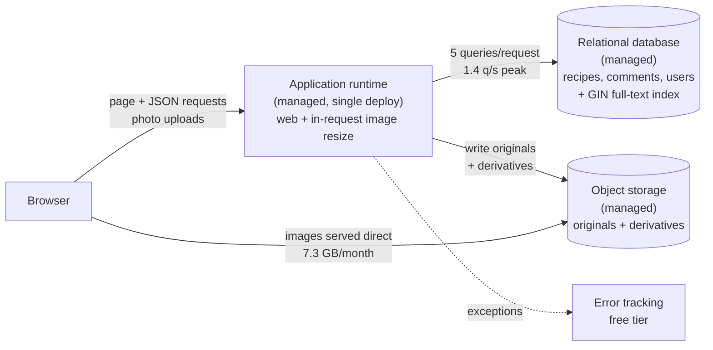

# Recipe-sharing web app — Architecture

**Stage 1 (MVP).** 100 registered users · 2 developers · £50/month infrastructure budget · no stated availability target · no stated compliance requirements.
Generated 2026-08-09 · OAB 0.1.0 · machine-readable companion: `.oab/design.json`

> **Arithmetic note.** The OAB calculators could not be executed in this environment, so every
> figure below was computed by hand from the documented formulas in `calculators/README.md`. The
> formula and the substituted values are printed for each so you can check them. Prices are from
> `knowledge/cost/_pricing.md`, checked 2026-08-09 — indicative ranges, not quotes.

---

## Executive summary

The real decision here is not "how do we build a scalable recipe platform". It is **which datastore,
which deployment target, and where the photos live** — for a system whose peak traffic is
**0.28 requests per second**.

**Recommendation: a single deployed application on a managed platform, one managed relational
database, managed object storage for photos, and a free-tier error tracker.** Image resizing happens
in the request path. That is the whole architecture.

The numbers that justify it:

| Measure | Value | What it rules out |
| :-- | --: | :-- |
| Peak requests/second | **0.28** | Load balancer, horizontal scaling, autoscaling |
| Mean concurrency (Little's Law) | **0.048** | Anything beyond one small instance |
| Peak database queries/second | **1.4** | Read replica, cache |
| Database connections needed | **5** of ~25 (20%) | Connection pooler |
| Database growth | **0.015 GB/year** | Partitioning, sharding, a second datastore |
| Photo storage growth | **8.7 GB/year** | Nothing — but it is why object storage is in the design |
| Origin egress | **7.3 GB/month** | CDN (break-even is ~1 TB/month) |
| Background jobs | **6.8/day** | Queue component, broker, separate worker service |

The decision is **insensitive across the entire plausible input range**. Even at 100% daily-active
users, three sessions a day, sixty requests a session and a 20× peak factor, this is 4.2 requests per
second — still one instance with an order of magnitude of headroom. That is a stronger finding than
any single number: you do not need to measure traffic before building this, because no measurement in
the plausible range changes the answer.

**Complexity: 4 / 4 — no headroom.** Adding a cache, a CDN, a search engine or a separate worker
requires removing one of the four components or adding an engineer.

**The headline trade-off.** The invoice is £15–36/month, comfortably inside £50. The *operational*
cost of the same architecture is roughly **£960/month** of engineering attention — about 30× the
invoice. This is why the complexity budget, not the £50 budget, is the binding constraint today, and
it is the single most important thing to understand about this design. The £50 budget only starts to
bind on growth: it is exceeded at roughly **3,800 registered users**, and the line that breaks it is
**image egress**, not compute.

**What deserves attention that is not architectural**: a tested restore. Database recovery time is
the binding constraint on this system's availability, and it is currently unmeasured.

---

## Assumptions

Every gap is listed. Correct an input rather than distrusting the analysis.

| Assumption | Confidence | Impact if wrong |
| :-- | :-- | :-- |
| 30% of registered users are daily active | low | Linear on RPS and egress. At 100% every figure is 3.3× larger; recommendation unchanged. |
| 2 sessions/day, 40 requests/session | low | Linear on RPS. At 3 × 60 the peak is 4.2 RPS, still one instance. |
| Consumer traffic shape, peak factor 10 | medium | Linear on peak. At 20× the peak is 0.56 RPS; no provisioning decision changes. |
| 0.5 recipes published per user per month (≈1.7/day) | low | Linear on storage. 10× is 87 GB of photos/year ≈ £1.30–2.20/month. No decision changes. |
| **4 photos/recipe, 2.5 MB per upload, +40% for derivatives (3.5 MB stored)** | **low** | **Dominant uncertain input. Drives storage, egress, and the point at which £50 is exceeded. Measure this first.** |
| ~20 comments/day at 500 B/row | low | Negligible — about 4 MB/year. |
| 100 KB average served payload (≈4 MB/session, image-dominated) | low | Linear on egress, the cost line that eventually breaks the budget. |
| 5 queries/request at 5 ms mean | medium | Linear on connections. Even at 20 queries/request the pool stays at its floor of 5. |
| Image resize ≈ 3 s CPU per photo | medium | Determines whether resizing stays in the request path. At 6.8 photos/day, it can. |
| No compliance, residency or data-sensitivity constraints (as stated) | medium | Would change residency, deletion and audit entirely. See the note below. |
| Both developers are product engineers, no dedicated ops, familiar with managed relational databases and object storage | medium | Sets the budget at 4. **An unfamiliar technology adds 1 point and puts this design at 5/4**, which would make option A₀ the correct selection instead. |
| No availability target exists, and hours of downtime are tolerable | medium | If 99.9%+ is genuinely required, database failover is needed and £50 is not enough. |
| One codebase deployed as one unit | medium | Each additional independently deployed service costs 1 point against a budget with none spare. |

> **On "no compliance requirements".** Taken at face value — no regulated-industry programme is
> assumed and nothing in this design is built for one. But consumer accounts plus user-uploaded
> photos carry baseline UK/EU data-protection duties whether or not a compliance programme exists:
> account deletion must actually remove objects from object storage, and a retention policy should be
> written down. Both are near-free to build now and awkward to retrofit. Flagged, not designed around.

---

## Capacity

### Requests per second

```
requests_per_day = users × dau_share × sessions_per_day × requests_per_session
avg_rps          = requests_per_day / 86400
peak_rps         = avg_rps × peak_factor

requests_per_day = 100 × 0.30 × 2 × 40  = 2,400
avg_rps          = 2,400 / 86,400       = 0.028 requests/second
peak_rps         = 0.028 × 10           = 0.28 requests/second
```

Safety margin: 2× on the peak factor, because an assumed traffic shape is the least reliable input
here. Even at 0.56 RPS this is three orders of magnitude below one small instance.

### Concurrency — Little's Law

```
L           = arrival_rate × service_time_seconds
provisioned = L / target_utilisation

L           = 0.28 × 0.12 = 0.034 concurrent requests
provisioned = 0.034 / 0.7 = 0.048
```

Sized for 70% utilisation, not 100%, because waiting time grows non-linearly as utilisation
approaches 1. A default web server with 4–8 workers is roughly 100× over-provisioned. Little's Law
gives the mean; the worker floor absorbs the tail.

### Database connections — and whether a pooler is justified

```
concurrent        = query_rate × query_time_seconds
pool_per_instance = max(min_pool, ceil(concurrent / instances × safety))

concurrent        = 1.4 × 0.005 = 0.0070
pool_per_instance = max(5, ceil(0.0070 × 4)) = 5
utilisation       = 5 / 25 = 20% of max_connections
```

**Verdict: no connection pooler.** The threshold is 80% of `max_connections`; demand is 20%. Even at
20 queries per request and 20 ms per query it stays at the floor of 5.

### Storage — relational

```
bytes_per_day  = writes_per_day × avg_record_bytes × index_overhead
bytes_per_year = bytes_per_day × 365

bytes_per_day  = (1.7 × 4,000 + 20 × 500) × 2.5 = 16,800 × 2.5 = 42,000 B/day
bytes_per_year = 42,000 × 365 = 15.3 MB       = 0.015 GB/year
```

`index_overhead` of 2.5 converts row size to stored size: indexes, tuple headers, page fill factor,
dead-tuple slack. **15 MB per year against a 10 GB starter plan is roughly 650 years of runway.** Even
10× wrong on every write assumption, database size is not a design constraint for this system.

### Storage — photos

```
bytes_per_day  = 6.8 × 3,500,000 × 1.0 = 23.8 MB/day
bytes_per_year = 23.8 MB × 365         = 8.7 GB/year
```

`index_overhead` is deliberately **1.0**, not the 2.5 default: that constant is a relational-database
concept and applying it to object storage would overstate this by 2.5×.

Photos are **580× the byte volume of the relational data**. That ratio, not a preference for object
storage, is why photos do not live in the database or on an instance disk.

### Egress

```
bytes_per_second = avg_rps × avg_payload_bytes
egress_per_month = bytes_per_second × 2,592,000

bytes_per_second = 0.028 × 100,000 = 2,800 B/s
egress_per_month = 2,800 × 2,592,000 = 7.26 GB ≈ 7.3 GB/month
cost             = 7.3 × £0.04–0.09  = £0.29–0.66/month
```

Computed on **average** RPS, not peak — egress is billed on volume. 7.3 GB/month is two orders of
magnitude below the ~1 TB/month at which edge offload repays its complexity point.

### Background work — image resizing

```
workers  = ceil(arrival_rate × service_time_seconds / target_utilisation)
capacity = workers / service_time_seconds

arrival_rate = 6.8 photos/day = 0.000079 jobs/second
workers      = ceil(0.000079 × 3 / 0.7) = ceil(0.00034) = 1
capacity     = 1 / 3 = 0.33 jobs/second — a margin of 4,200×
```

At 1,000× the assumed rate a single process at 24% utilisation still keeps up. There is no queueing
problem, which is why resizing stays in the request path.

### Sensitivity — the input to measure first

**Measure average photo size and photos-per-recipe.** It is the dominant uncertain input in the
entire analysis: it drives object storage, egress, and therefore the user count at which £50 is
exceeded. One week of real data resolves it.

Everything else is insensitive. Across the full plausible range of every traffic assumption, the
architecture is identical — one instance, one database, object storage. The only thing that moves is
the invoice, and the trigger for that is measured directly.

---

## Architecture



| Component | Points | Why it exists — in numbers |
| :-- | --: | :-- |
| **Application runtime** (managed, one deployed unit) | 1 | Peak 0.28 RPS, mean concurrency 0.048. One small instance is ~1,000× over-provisioned, so a load balancer and horizontal scaling have nothing to solve. Resizing runs in this process at 6.8 photos/day. |
| **Relational database** (managed, smallest class) | 1 | The workload is relational: recipes belong to authors, comments to recipes and authors, tags many-to-many. 0.015 GB/year against a 10 GB plan; 1.4 queries/second; 5 connections of ~25. Search over ~600 recipes/year is a GIN index on this same instance. |
| **Object storage** (managed) | 1 | 8.7 GB/year of photos against 0.015 GB/year of rows — a 580:1 ratio. Serving 3.5 MB/photo from instances or the database would put the largest byte volume in the least durable place. Costs ~£0.13–0.22/month. |
| **Error tracking** (managed, free tier) | 1 | Two developers, no ops capacity, no availability target. At ~2,400 requests/day the event volume sits inside every free tier, so the infrastructure cost is £0 and the entire cost is the fourth complexity point. **This is the one stage-2 element deliberately pulled forward.** |

**Upload path.** Browser → app → resize in-process → write original and derivatives to object storage
→ browser reads images directly from object-storage URLs. Presigned direct-to-storage upload was
considered and dropped: at 6.8 photos/day, proxying 2.5 MB through the app costs nothing and avoids a
signing flow, a webhook, and an orphaned-object cleanup path.

**Techniques included at zero complexity cost** — these change how the four components behave and add
no operational surface: explicit connect and read timeouts on every outbound call; retries with
exponential backoff and jitter on idempotent operations only; idempotency on the publish and upload
paths so a retried submit does not duplicate a recipe; expand-contract schema migrations so no
deploy needs downtime; a GIN index for full-text search; in-process caching of rendered fragments if
ever needed.

---

## What was rejected, and when to revisit

The measurement that would change each answer:

| Rejected | Why, in numbers | Revisit when |
| :-- | :-- | :-- |
| **Cache** (managed key-value) | Peak reads 1.3/second against a comfortable origin. No key approaches the ~10 req/s threshold in `when-not-to-cache`. Buys a component, a staleness class and an invalidation question per write path. | One query exceeds 100 req/min at >50 ms — **measured before anything is added**. |
| **CDN / edge cache** | 7.3 GB/month egress vs a ~1 TB/month break-even. Saves under £0.70/month against a point worth ~£240/month of attention. *If your object store or platform includes edge delivery at no extra operational surface, take it — that costs 0 points and this arithmetic does not apply.* | Origin egress >250 GB/month for 2 months. **Most likely trigger to fire first** — egress scales linearly with users. |
| **Queue / message broker** | 0.000079 jobs/second against one worker's 0.33 — a 4,200× margin. `when-you-need-streaming` applies at stages 4–5 only. | >200 uploads/day, or p95 upload >5 s twice in a week. The action is a **database-backed queue on the existing database (0 points)**, not a broker. |
| **Separate worker service** | +1 point against a budget at 4/4, buying nothing at 6.8 jobs/day. | Background work exceeds one process at 70% utilisation. |
| **Read replica** | `read-replicas` is stage 3–5. Primary serves 1.4 q/s. A replica adds replication lag, making read-after-write a *correctness* problem on the publish and comment paths. | DB CPU >70% for 3 days **and** the workload measures read-dominated **and** indexing is exhausted. |
| **Search engine** | Corpus is ~600 recipes/year. Postgres full-text with a GIN index returns in single-digit ms over tens of thousands of rows. A second datastore technology costs +1 on top of its own weight. | >100,000 recipes, or p95 search >300 ms with `EXPLAIN` confirming the GIN index is in use. |
| **Connection pooler** | 5 connections of ~25 = 20%, against an 80% threshold. Below it, a pooler adds a hop and a process for nothing. | Connections >80% of `max_connections` for 1 hour, recurring. |
| **Orchestration platform** | 4 points — the entire budget — to schedule one container at 0.28 RPS. Also blocked by rule R-F: stage-1 system, stage-4 machinery. | Not at this scale. Re-evaluate above ~10 independently deployed services **with** dedicated ops headcount (which adds 4 points per person). |
| **Document database** | Recipes have stable structure and heavy relationships — author, comments, tags, likes are all joins. No heterogeneous-schema pressure. | Recipe documents become genuinely heterogeneous **and** queries stop joining across entities. |
| **Multi-AZ failover / multi-region** | £400–600/month for a replicated database — 8–12× the entire budget — to buy availability nobody asked for. | The business states a 99.95%+ target and raises the budget. A requirements change, not a metric. |
| **Log aggregation platform** | Log ingestion is £0.40–2.00/GB and is the classic unbudgeted line. Platform logs plus the error tracker cover every trigger in this design at 0 additional points. | An incident cannot be diagnosed from platform logs and error-tracker events, twice in a quarter. |

---

## Options considered

| Option | Points | £/month | Reversibility | Verdict |
| :-- | --: | :-- | :-- | :-- |
| **A — Managed monolith** (app + relational DB + object storage + error tracking) | **4** | 15–36 | easy | **Selected** |
| A₀ — Same, without error tracking | 3 | 15–36 | easy | Deferred |
| B — Single VM, self-hosted app + Postgres + local disk | 5 | 16–27 | moderate | Rejected |
| C — Serverless + pooler + CDN + queue | 6 | 12–30 | moderate | Rejected |

**A₀ is the strictly simplest viable option, and it is genuinely viable.** It preserves a point of
headroom, which has real value for a team with none, and nothing else in the design changes. It is
deferred rather than selected because two developers with no operations capacity and no availability
target need a tool that tells them a deploy broke; without it they find out from a user. *The
measurement that decides it:* whether platform logs alone surface production exceptions within the
team's tolerance over one month of real traffic. If you would rather hold the fourth point in
reserve, take A₀ — that is a defensible call, not a worse one.

**B — single VM — is stated fairly and rejected on arithmetic, not taste.** It has the cheapest
invoice by £5–10/month, and one box is genuinely simpler to reason about. But self-hosted stateless
(2) plus self-hosted stateful (3) is 5 points ≈ **£1,200/month** of engineering attention against
option A's £960 — the "cheap" option is about £240/month more expensive once operations are counted.
It also puts 8.7 GB/year of user photos on a single unreplicated disk whose backup is your problem,
and permanent photo loss is the one failure this product cannot recover from. *The measurement that
changes it:* if the team already operates PostgreSQL on VMs for another system, the marginal cost
falls to ~1–2 points and B becomes cheaper on both lines; or if managed database pricing for this
workload exceeded ~£300/month.

**C — serverless — is 50% over budget and the excess is self-inflicted.** On invoice it is
competitive: 72,000 invocations/month is about £0.04. But of its six components, three exist to
compensate for the first — the pooler repairs a connection problem serverless creates, the CDN
offloads 7.3 GB against a 1 TB break-even, the queue handles 6.8 jobs/day — and image resizing runs
into function time and memory limits. Cold starts on an app that is idle 99.99% of the time are
user-visible on the first request. *The measurement that changes it:* if the instance line exceeded
~£25/month while median CPU stayed under 5%, idle compute would be the dominant waste and
per-invocation pricing would win.

---

## Complexity budget

```
available = 4 + 1.5 × max(0, engineers − 2) + 4 × dedicated_ops
          = 4 + 1.5 × 0 + 4 × 0
          = 4

spent     = application runtime (managed stateless)  1
          + relational database (managed stateful)   1
          + object storage      (managed stateless)  1
          + error tracking      (managed stateless)  1
          + modifiers: additional datastore technologies 0
                       additional deployed services      0
                       unfamiliar technologies           0
          =                                          4
```

```
Complexity: 4 / 4 — no headroom. Adding a cache, a CDN, a search engine or a
separate worker requires removing something or adding an engineer.
```

That sentence is the point of the exercise. A cache is not "nice to have later" — it is a trade
against one of the four components already here. Dropping error tracking returns you to 3/4 and one
point of slack; that is the explicit trade, and it is yours to make.

**Two things would push this over budget without any component being added.** If either developer has
not operated a managed relational database or managed object storage before, the unfamiliar-technology
modifier applies and the spend becomes 5–6 against 4. And if the app and a worker are deployed
independently, that is +1. Both are worth checking before committing.

> **Limitations of the budget, stated plainly.** The constants — 4, 1.5, 4, and every component
> weight — are judgement calibrated against experience, **not measurement**. The model does not
> account for coupling: three tightly-coupled services score the same as three independent ones. It
> treats all managed services as equal, though managed event streaming is far harder to run well than
> managed object storage. And it says nothing about whether this architecture is *correct* — only
> whether two people can carry it. Treat 4/4 as a signal to make the next addition an explicit trade,
> not as a law.

---

## Cost

Prices from `knowledge/cost/_pricing.md`, checked **2026-08-09**. Indicative ranges, provider-neutral,
not quotes.

| Line | Basis | £/month |
| :-- | :-- | --: |
| Small managed app instance | 0.5–1 vCPU, 512 MB–1 GB | 5–15 |
| Smallest managed relational | shared CPU, 1 GB RAM, 10 GB | 10–20 |
| Object storage | 8.7 GB after year 1 × £0.015–0.025 | 0.13–0.22 |
| Origin egress | 7.3 GB × £0.04–0.09 | 0.29–0.66 |
| Backup storage | ~1 GB | 0.02–0.05 |
| Error tracking | free tier at this volume | 0 |
| **Infrastructure total** | | **15–36** |

**Against a £50 budget: met, with £14–35 of headroom.**

```
operational = complexity_points × hours_per_point × loaded_hourly_rate
            = 4 × 4 × £60
            = £960/month        (range £480–1,440 at 2–6 hours/point)
```

| | Low | High |
| :-- | --: | --: |
| Infrastructure | £15 | £36 |
| Operational | £480 | £1,440 |
| **Total** | **£495** | **£1,476** |

The operational line exceeds the infrastructure line by roughly **30×**. This is normal for a small
team, invisible in every cloud pricing calculator, and it is the reason the complexity budget rather
than the £50 budget governs this design. It is also why each additional component costs ~£240/month
of attention against a £50 infrastructure allowance — the fifth component is more expensive than the
entire hosting bill.

*Those constants (4 hours/point, £60/hour loaded) are judgement, not measurement. Track your actual
hours for a quarter and replace them.*

**When the £50 budget breaks.** Egress and object storage scale linearly with users; compute and the
database do not, for a long time.

```
total ≈ £25 fixed + (0.073 GB egress + 0.087 GB storage) per user per month
      = 50  ⟹  u ≈ 3,800 users at mid-range prices
```

Range: **~1,700 users** at the top of every price range, **~8,300** at the bottom. When it fires, the
first lever is **image payload size and edge offload**, not a bigger instance.

---

## Reliability

**No availability target was stated, and none has been invented.** What this architecture actually
delivers:

**~99% — about 7.3 hours of permitted downtime per month.** Single application instance with
platform-level process restart; single-AZ managed database with automated daily backups and
point-in-time recovery; object storage whose durability is the provider's problem.

The binding constraint is **database recovery**: restoring from backup is tens of minutes to hours
with a human in the loop. Any target implying less than about an hour of monthly downtime is not
deliverable by this architecture, and claiming otherwise would be the failure mode
`availability-targets` exists to prevent.

| If you want | You need | Cost |
| :-- | :-- | :-- |
| 99% (7.3 h/month) | What is here | £15–36/month |
| 99.9% (43 min/month) | Deploys without extended downtime, automated restart, **a tested restore** | **0 complexity points** — all technique, all recommended |
| 99.95% (22 min/month) | Redundant instances, health-checked routing, database failover | Multi-AZ database at £400–600/month — 8–12× the entire budget |

**99.9% is available for free.** Deploy without downtime, restart automatically, and — the part teams
skip — actually restore a backup into a scratch database and time it. An untested restore is not a
backup, and right now the recovery time that governs this system's availability is unmeasured. That
is the single highest-value reliability action available, and it costs an afternoon.

**Failure modes worth naming.** Object storage unavailable → recipe pages render without images
rather than erroring (decide this now, not during the incident). Database unavailable → the site is
down; there is no degraded read path, and buying one costs the budget above. Image resize fails →
the recipe must still publish, with a placeholder and a retry, or a failed resize silently loses a
user's post.

---

## Evolution triggers

Each is measurable, has a named source, a sustained window, and an owner. The action is always a next
step, never a pre-decided outcome.

| Trigger | Metric > threshold | Window | Source | Action |
| :-- | :-- | :-- | :-- | :-- |
| `monthly-infrastructure-spend` | > £60/month | 2 consecutive months | provider billing dashboard | Break down by line; re-run bandwidth and storage against measured volumes. Egress is the expected dominant line. |
| `origin-egress-volume` | > 250 GB/month | 2 consecutive months | billing dashboard, transfer line | Cost edge offload at current pricing. **Reducing served image dimensions is often the larger win and costs 0 points.** |
| `registered-users-past-sensitivity-limit` | > 3,000 users | confirmed, not projected | admin page, monthly product review | Re-run capacity with *measured* DAU share, requests/session and photo sizes. |
| `app-instance-cpu-sustained` | > 70% at peak | 3 consecutive days | platform metrics dashboard | Profile the dominant path; confirm whether in-request resizing is the cause before resizing the instance. |
| `db-cpu-sustained` | > 70% | 3 consecutive days | managed database metrics | Identify the dominant query from the statistics view; evaluate indexing before a replica or cache. |
| `db-storage-used` | > 60% of plan (6 GB) | 1 week | managed database metrics | Decide retention or plan size at 60%, not 95%. *If this fires, the 0.015 GB/year projection was wrong — that is the finding.* |
| `db-connection-utilisation` | > 80% of `max_connections` | 1 hour, recurring in a month | managed database metrics | Re-run the connections calculation against measured rates; tune pool config before adding a pooler. |
| `upload-p95-latency` | > 5,000 ms | 2 occurrences in a week | app request timing → platform metrics | Profile the resize; evaluate a **database-backed queue (0 points)** before a worker or a broker. |
| `search-p95-latency` | > 300 ms | 1 day | app request timing + statement statistics | Confirm via `EXPLAIN` that the GIN index is used; only then analyse a search component. |
| `restore-drill-overdue` | > 180 days since last restore | quarterly review | dated line in the operations note | Restore into a scratch database, **time it**, record the measured recovery time. |

**Two of these metrics do not exist yet.** `upload-p95-latency` and `search-p95-latency` need
per-endpoint request timing. Instrumenting it is **a prerequisite of this decision, not a
follow-up** — in-request image resizing is the design choice those triggers guard, and without the
metric the trigger never fires.

Thresholds are set where analysis can still start, not at the cliff: 70% utilisation while latency is
still linear, 60% of a storage plan, 250 GB against a 1 TB break-even, 3,000 users against a ~3,800
crossover.

Verify quarterly that each named dashboard still exists and each threshold still means what it meant.

---

## Open questions

1. **What is the actual average photo size and photos-per-recipe?** The dominant uncertain input in
   the whole analysis — it drives storage, egress, and the user count at which £50 is exceeded. One
   week of measurement resolves it.
2. **Is there an availability expectation nobody has written down?** This delivers ~99% and recovers
   from database loss by restore. If a day of downtime would be a business problem, that is a
   requirements change with a price attached.
3. **Are the users in the UK or EU?** No compliance requirements were stated, but consumer accounts
   plus user-uploaded photos carry baseline data-protection duties regardless: deletion that actually
   removes objects from storage, and a written retention policy. Cheap now, awkward later.
4. **Is user-uploaded content moderated?** Public photo upload with no review is a product and legal
   exposure rather than an architectural one, but it decides whether uploads need a pending state
   before publication.
5. **Has either developer operated a managed relational database and managed object storage before?**
   If not, the unfamiliar-technology modifier adds 1–2 points, this design goes over budget, and
   option A₀ becomes the correct selection.

---

## Confidence

**High — in the decision. Medium-to-low in the individual numbers.**

That distinction is deliberate and it is the honest position. Several inputs are low-confidence
assumptions, so no single figure above deserves more than two significant figures of trust. But the
sensitivity analysis shows the conclusion holds across the entire plausible range of every one of
them: at 100% daily-active users with a 20× peak factor and 10× the assumed photo volume, the answer
is still one instance, one relational database, and object storage.

The one place confidence is genuinely lower is **cost at growth**, where the crossover spans
1,700–8,300 users depending on photo sizes and provider pricing. That is why it is a measured trigger
rather than a design decision.
