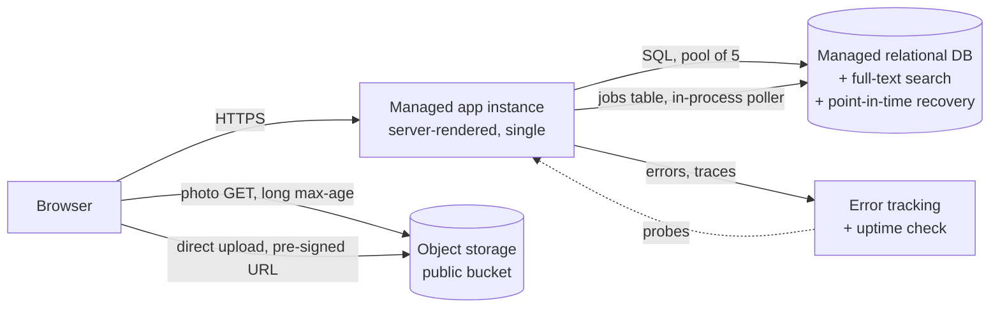

# Recipe-sharing web app — Architecture

**Generated** 2026-08-09 · **Stage** 1 (MVP) · **Complexity** 4 / 4 · **Confidence** high
**Artifact** [`.oab/design.json`](design.json)

---

## Executive summary

**The decision actually being made is not "how do we build a scalable recipe platform".** It is:
which datastore, which deployment target, and where do the photos live — for a system with 100
registered users, two developers who also write the product, and £50/month.

**The recommendation is four managed components and nothing else:**

| | Component | Points | Why it exists |
| :-- | :-- | --: | :-- |
| 1 | Managed application instance (single, server-rendered) | 1 | 0.28 peak requests/second against ~100 req/s of capacity |
| 2 | Managed relational database, smallest tier | 1 | 0.017 GB/year of data; a join graph; full-text search included |
| 3 | Object storage bucket for photos | 1 | 9.9 GB/year of images, kept off the app instance |
| 4 | Managed error tracking + uptime check (free tier) | 1 | Failure detection is scale-independent; also the source three triggers read from |

**The numbers that drive it.** Peak traffic is **0.28 requests/second**. Mean in-flight concurrency
is **0.042 operations**. The database sees **0.83 queries/second** and needs **5 connections of a
100-connection limit**. Egress is **9.4 GB/month**, costing about **£1**. Every one of those is
three to four orders of magnitude below the threshold at which the corresponding component —
horizontal scaling, a cache, a pooler, a CDN — has a problem to solve.

**The sensitivity analysis is stronger than any single number.** At 100% daily-active users, three
sessions a day, 60 requests a session and a 20× peak factor, peak traffic is **4.2 requests/second**.
The recommendation is identical across that entire range. The assumptions below are low-confidence
and it does not matter; **the decision is insensitive to all of them up to roughly 5,000 registered
users**, which is why that figure is a trigger rather than a question.

**The headline trade-off** is that this design is at exactly 4/4 complexity points. It buys
simplicity with a single application instance, which means **every deploy and every platform restart
is briefly user-visible**, and realistic availability of about **99.5%** — roughly 3.6 hours a month.
No availability target was stated, so none has been invented; that number is reported so it can be
accepted or rejected on purpose.

**The most expensive line is not on the invoice.** Infrastructure is **£22–45/month**. Operational
cost — 4 points × 4 engineer-hours × £60/hour — is about **£960/month** of the two developers'
attention. That ratio is the reason the cheapest option in this analysis (a single self-hosted VPS
at £16–28/month) is also the most expensive architecture, at roughly **£1,460/month all-in**.

---

## Assumptions

Nothing here was asked. Six discovery questions were considered and none passed the sensitivity
test — the answers would not have changed the recommendation anywhere in their plausible range —
so all of it is stated instead, with a confidence and the impact if wrong.

| Assumption | Confidence | Impact if wrong |
| :-- | :-- | :-- |
| 30% of the 100 registered users are daily active | low | Proportional on RPS. At 100% it is 1.9 req/s — still four orders of magnitude inside one instance. |
| 2 sessions/day, 40 requests/session | low | Proportional on RPS and egress. Doubling both keeps peak under 1.2 req/s. |
| Peak factor 10× (single-timezone consumer app; people cook in the evening) | medium | Proportional on peak only. At 20× peak is 0.56 req/s. |
| ~3 recipes and ~15 comments published per day, community-wide | low | Proportional on database growth. 10× is 0.17 GB/year — still inside the free tier. |
| 3 photos/recipe, 2.5 MB original + ~0.75 MB derivatives, kept forever | low | **Dominant storage input.** 10× is 99 GB/year and £2/month — affordable, but it moves the storage trigger. |
| 95:5 read:write ratio on HTTP requests | medium | Shifts the split, not the totals. |
| 140 KB average response payload across all requests | medium | **Decides whether a CDN is ever justified.** |
| No compliance, residency or data-sensitivity constraint | medium | Would change hosting region, processing terms and audit entirely. **This is the one-way door.** |
| The team already knows a mainstream web framework and a relational database | medium | +1 point per unfamiliar component — at 4/4 that is instantly over budget. |
| Photos are public once a recipe is published | medium | Private photos put the app in the image path and change both the egress and the compute analysis. |
| Catalogue is order 10³ recipes, so relational full-text search suffices | medium | Above ~10⁵ documents a search engine becomes a real question. |

---

## Capacity

Computed with `calculators/oab_calc` (OAB 0.1.0). Peak is used for provisioning, average for volume
and cost.

### Requests

```
requests_per_day = users × dau_share × sessions_per_day × requests_per_session
                 = 100 × 0.3 × 2 × 40 = 2,400
avg_rps          = 2,400 / 86,400              = 0.0278  req/s
peak_rps         = 0.0278 × 10                 = 0.28    req/s   (range 0.028 – 1.9)
```

**Sensitivity — the dominant input is daily-active share.** At 100% DAU, 3 sessions/day, 60
requests/session and a 20× peak factor: **4.2 req/s**. A single small instance serves that with
three orders of magnitude to spare. **The decision does not change anywhere in the plausible input
range.**

### Storage

```
relational:  bytes_per_day = 18 × 1,100 × 2.5 = 49,500 B   →  0.017 GB/year   (2.5× index/page overhead)
photos:      bytes_per_day = 9 × 3,250,000 × 1.0 = 29.25 MB →  9.9  GB/year   (range 5.0 – 20.0)
```

Relational data would have to be **100× this estimate** before it threatened the 10 GB included with
the smallest managed tier. Text does not threaten this design; photos do — and even those are £2/month
at 100 GB. No retention policy is assumed, so photo storage grows without a plateau; that is what the
`object-storage-volume` trigger watches.

### Egress

```
bytes_per_second = 0.0278 × 140,000        = 3,892 B/s  (0.031 Mbps)
egress_per_month = 3,892 × 2,592,000       = 9.4 GB/month
cost             = 9.4 × £0.09             ≈ £0.85/month
```

Egress would have to grow **~30×, to about 300 GB/month**, before origin transfer costs £27/month
and starts competing with the £50 budget. That is the CDN trigger threshold — set well below the
usual 1 TB rule of thumb precisely *because* the budget is £50.

### Concurrency and connections

```
L                 = 0.278 × 0.15 s          = 0.042 concurrent operations
provisioned       = 0.042 / 0.7             = 0.060           (sized for 70% utilisation)

concurrent        = 0.83 q/s × 0.005 s      = 0.00415
pool_per_instance = max(5, ⌈0.00415 × 4⌉)   = 5 connections    (4× tail safety, floor of 5)
```

**5 connections is 5% of a 100-connection limit.** Even against the ~25-connection cap of the very
smallest managed tiers it is 20%. A connection pooler is unjustified below 80%. Service time would
have to reach 2.5 seconds before mean concurrency reached 1 — the four worker processes a default
deployment ships with are already ~100× oversized.

---

## Architecture



**Application instance — 1 point.** One managed, server-rendered deployable. Peak 0.28 req/s and
0.042 mean concurrency against an instance that handles order 100 req/s: roughly three orders of
magnitude of headroom. Managed rather than a bare VM so TLS, patching and restart-on-crash are not
the two developers' problem.

**Managed relational database — 1 point.** Relational because recipes, users, comments and tags form
a join graph with a natural access pattern, and because the database's own full-text index (plus a
trigram index for typo tolerance) removes an entire component from the design. A recipe *looks* like
a document, which is the trap — a JSON column covers the document-shaped part. Managed rather than
self-hosted for tested point-in-time recovery: an untested restore is not a backup, and a two-person
team shipping product will not build or drill one.

**Object storage — 1 point.** Photos go to a bucket, not to the instance's disk. This decouples
storage growth from compute, survives a redeploy, and keeps 9.4 GB/month of image bytes off the
app's bandwidth allowance. Browsers upload **direct to the bucket via a pre-signed URL**, so a 2.5 MB
upload never occupies an application worker. URLs are content-hashed and immutable with a long
`Cache-Control: max-age`, which captures most of the browser-cache benefit a CDN would provide, for free.

**Error tracking and uptime check — 1 point.** Free tier at this volume, so **£0 on the invoice and
1 point of attention**. Included not because the traffic justifies it but because failure detection
is a scale-independent fundamental: with one instance and no operations capacity, the alternative is
learning about a 500 from a user. It also supplies the metric source that three triggers name, and a
trigger whose metric nobody emits never fires.

### Techniques used, which cost 0 points

These change how existing components behave and add no operational surface, so the model prices them
at zero — and they are reached for first:

- **Image resizing inside the upload request.** 9 photos/day; the caller needs the result; it fits
  the latency budget. Making it asynchronous would add polling, a status model and a worse
  experience in exchange for nothing.
- **A jobs table in the database already present**, polled in-process, for anything that genuinely
  should leave the request path (an outbound email, a thumbnail retry). This removes the dual-write
  problem by construction.
- **Explicit connect and read timeouts on every outbound call**, and retries with exponential
  backoff and jitter on idempotent operations only.
- **Expand–contract schema migrations**, so a schema change never needs downtime or a synchronised deploy.
- **In-process page fragment caching** and HTTP cache headers — the parts of caching that are free.

---

## What was rejected, and the measurement that reverses it

This is the most useful section in the document. Every rejection names a number.

| Rejected | Why, in numbers | Revisit when |
| :-- | :-- | :-- |
| **Cache** | Peak reads are 0.27/s **across the whole application**. No key approaches the ~10 req/s at >50 ms recompute below which a cache relieves nothing measurable. It would add a component, a failure mode and a permanent invalidation question on every write path, to relieve a database under 1% utilised. | A single query class exceeds 10 req/s at >50 ms, **or** database CPU >70% for 3 days after indexes are checked |
| **CDN / edge cache** | Egress is 9.4 GB/month, costing ~£1. Edge offload does not repay its point below a few hundred GB/month; we are 30× below even that. | Origin egress >300 GB/month sustained 2 months (= £27/month, over half the budget) |
| **Queue (managed broker)** | 9 resizes and ~18 content writes per day. A jobs table on the existing database gives durability at 0 points. | Jobs table >50 jobs/s sustained, or job p95 latency >60 s after a normal spike, twice in a month |
| **Event stream** | Earns its 3 points above ~500 events/s sustained, or 3+ independent consumer groups needing replay. This system has 0.014 writes/s and one consumer of anything. | >500 events/s at peak over a week, **or** 3+ confirmed consumer groups needing replay |
| **Read replica** | Primary is idle: 0.83 q/s, 5 of 100 connections. A replica adds replication lag and a read-your-writes correctness question for no measured benefit. | Database CPU >70% for 3 days *after* query and index optimisation |
| **Search engine** | Relational full-text + trigram indexes serve ~10³ recipes. A second datastore technology costs +1 point on top of its own cost, plus an indexing pipeline and a consistency question. | Search p95 >300 ms for a day, **or** catalogue >100,000 recipes, **or** a stated ranking/faceting requirement the database provably cannot meet |
| **Connection pooler** | 5 of 100 connections is 5% (20% against the smallest tiers' ~25 cap). Below 80% a pooler is a process and a hop for nothing. | Connection usage >80% of `max_connections` for 1 hour, recurring |
| **Load balancer** | One instance, and the managed platform already terminates TLS and routes to it. A load balancer with one backend is a thing that can fail in front of a thing that can fail. | A second instance is required — which the app-CPU trigger would prompt |
| **Orchestration platform** | 4 points on its own — *the entire budget of a two-person team* — plus a control plane to keep alive, for one deployable with three orders of magnitude of headroom. | More deployable services than the team can run by hand, **and** dedicated operations capacity. Neither is true at 2 developers and 1 service. |
| **Separate worker fleet** | 1 point for the component + 1 for the additional deployed service. 9 resizes/day fits in the upload request. | Background work pushes p95 request latency past the 800 ms target, or in-process jobs contend with request serving |
| **Document database** | Comments, users, tags and moderation are a join graph, and browse-and-search wants full-text indexing over it. A JSON column covers the document-shaped part. | A schema requirement genuinely varies per record beyond what a JSON column expresses, **or** a measured query pattern is join-free end to end |

---

## Options considered

The expensive option was generated first, failed the budget gate, and **sent the design back to
generate simpler options** — rather than forward to justify itself.

| Option | Points | Infra £/mo | All-in £/mo | Reversibility | Verdict |
| :-- | --: | --: | --: | :-- | :-- |
| **Managed monolith + error tracking** | **4** | **22–45** | **~990** | easy | **selected** |
| Managed monolith, no observability | 3 | 22–40 | ~750 | easy | rejected |
| Single self-hosted VPS | 6 | 16–28 | ~1,460 | moderate | rejected |
| Containerised services + cache + CDN | 8 | 87–145 | ~2,040 | moderate | rejected |

**Managed monolith, no observability — the simplest viable option, stated fairly.** It is genuinely
one point cheaper and about £240/month cheaper in the operational model, with fewer accounts and one
less thing to configure. It is rejected **on a fundamental rather than on a measurement**, and that
distinction is deliberate: error tracking sits with tested restore, explicit timeouts and reversible
migrations among the things whose failure is *not* proportional to traffic, so a small system gets no
discount. There is no traffic number that makes this option correct — 0.28 req/s is exactly the
regime in which a silent 500 goes unnoticed for a week. It would also leave three of the seven
triggers with no source to read them from. **If the team already has an aggregated log search they
read daily, this option becomes correct and should be taken.**

**Single self-hosted VPS — the cheapest invoice and the most expensive architecture.** Self-hosting
the database is 3 points and the app plus reverse proxy is 2: **6 against an available budget of 4**,
or 150%, before any override. In money the model puts it at ~£1,460/month all-in against ~£990,
because £7/month of invoice saving buys about 8 engineer-hours/month of patching, backup verification
and restore drilling. **The measurement that reverses it:** if the team's own incident and maintenance
records show materially under 4 engineer-hours per complexity point per month, or if a dedicated
operations engineer joins — which alone raises the budget from 4 to 8 — it comes back into range.
Note that the £50 budget is *not* the binding constraint here; it accommodates the selected option
comfortably.

**Containerised services + cache + CDN — the option that failed the gate.** 8 points against 4 (200%)
and £116/month against £50 (232%). Every component in it is individually defensible in the abstract
and none has a measured problem here: the cache would relieve a database under 1% utilised, the CDN
would offload 9.4 GB/month, the second replica would take 0.042 concurrent operations, and the worker
would process 9 images a day. Four separate triggers below already watch for the moment any of them
earns its place — and **adopting them one at a time as those fire is strictly better than adopting
them together now**, because by then the real access patterns are known.

---

## Complexity budget

```
available = 4 + 1.5 × max(0, 2 − 2) + 4 × 0 = 4

app runtime (managed)        1
relational database (managed) 1
object storage (managed)      1
error tracking (managed)      1
                             ──
                              4
```

```
Complexity: 4 / 4 — no headroom. Adding a cache, a CDN or a worker requires
removing something already here, or adding an engineer.
```

No modifiers applied: one datastore technology, one independently deployed service, and no component
the team has not operated before. **If any of those three is wrong, this design is immediately over
budget** — an unfamiliar database alone would make it 5/4.

**The honest limitations of this figure.** The constants — the base of 4, the 1.5 per additional
engineer, and every component weight — are **judgement calibrated against experience, not
measurement**. The model does not capture coupling: three tightly-coupled services score the same as
three independent ones. It treats all managed services as equal, though managed event streaming is
far harder to operate well than managed object storage. It does not model team skill beyond a crude
unfamiliar-technology modifier. And it says nothing about whether the architecture is *correct* —
only whether two people can carry it.

---

## Cost

Price table dated **2026-08-09**; indicative provider-neutral ranges, not quotes.

| Line | £/month |
| :-- | --: |
| Managed app instance (0.5–1 vCPU, 512 MB–1 GB) | 5–15 |
| Smallest managed relational database (10 GB, PITR) | 10–20 |
| Object storage (~10 GB, growing 9.9 GB/year) | ~1 |
| Origin egress (9.4 GB @ £0.04–0.09/GB) | ~1 |
| Error tracking + uptime check | 0 (free tier) – 20 |
| **Infrastructure total** | **22 – 45** |
| **Operational** (4 points × 4 h × £60/h) | **720 – 1,200** |
| **All-in total** | **742 – 1,245** |

**Infrastructure fits inside the £50 budget with room, and the operational line is ~25× larger.**
That is normal for a two-person team, invisible in every cloud calculator, and the single most
important number in this document — it is why managed services win here, and why the £16/month VPS
is the expensive option.

The operational line rests on a default of **4 engineer-hours per complexity point per month**,
which is judgement rather than measurement. It is the input to calibrate first against the team's
own incident and maintenance records.

---

## Reliability

**No availability target was stated, so none has been invented** — inventing one manufactures
requirements and cost. What this architecture actually delivers:

| | |
| :-- | :-- |
| Realistic availability | **~99.5%** (≈3.6 h/month), measured as successful requests / total requests |
| Ceiling from serial dependencies | Platform (~99.9%) × database (~99.9%) ≈ **99.8%** *before* the team's own code, deploys and restarts |
| Recovery point objective | **Minutes**, via managed point-in-time recovery (requirement: 24 h) |
| Recovery time objective | **4 h**, and only if the restore has been drilled |

Reaching 99.9% needs a second instance behind health-checked routing, zero-downtime deploys and
database failover — roughly 3 more complexity points and ~3× the infrastructure cost. **If a
stakeholder wants 99.9%, that is a different design and a different budget**, and it should be a
decision rather than an aspiration.

At this stage the recovery objectives matter more than the availability number. Managed PITR gives an
RPO of minutes for free; **what keeps the RTO honest is a restore actually performed at least once**,
against a documented runbook, before it is needed. Put it in the calendar.

Two failure modes are worth naming explicitly because they are the ones this shape of system actually
hits: a **slow external dependency that never errors** (which is why every outbound call has an
explicit connect and read timeout derived from the page's own latency budget), and **a large photo
upload occupying a worker** (which is why uploads go direct to object storage rather than through the
application).

---

## Evolution triggers

Each has a metric that is observable today or whose instrumentation is in scope, a named source, a
sustained window, and an owner. **The action is a next step, not a pre-decided answer** — a trigger
that pre-decides the outcome makes the future analysis ceremonial.

| Trigger | Threshold | Window | Source | Action |
| :-- | :-- | :-- | :-- | :-- |
| `app-cpu-sustained` | >70% CPU | 1 h at daily peak, 3 consecutive days | Platform metrics dashboard | Re-run RPS/concurrency with measured numbers; evaluate vertical resize and profiling before a second instance |
| `registered-users-past-design-limit` | >5,000 users | Confirmed count, not projected | `SELECT count(*) FROM users`, monthly check-in | Re-run the whole capacity analysis; the assumptions stop being checked above this point |
| `db-cpu-sustained` | >70% CPU | 3 consecutive days | Managed DB provider dashboard | Identify the dominant query and check its indexes **first**; evaluate a replica or cache only after optimisation is exhausted |
| `origin-egress-volume` | >300 GB/month | 2 consecutive months | Provider invoice, transfer line | Compute edge-offload cost; check derivative sizes and cache headers first — payload reduction often beats offload |
| `object-storage-volume` | >50 GB stored | Confirmed monthly reading | Object storage console | Decide retention/tiering for photos on deleted recipes; re-run the projection with measured bytes-per-photo |
| `monthly-infrastructure-spend` | >£60/month | 2 consecutive months | Billing dashboard, monthly check-in | Break the invoice down by line; identify which capacity assumption moved before raising the budget or cutting a component |
| `search-latency-p95` | >300 ms | 1 day | Error tracking / performance dashboard | Check full-text and trigram indexes and the query plan; evaluate a search engine only against a stated requirement |

**Owner:** the two developers, on a weekly rotation. **Verification:** quarterly — confirm each metric
is still emitted and each threshold still means what it meant.

Two notes on threshold-setting. The **5,000-user** figure is not a round number chosen for comfort;
it is the sensitivity limit from the RPS analysis, the point below which the recommendation is
*provably* unchanged. The **300 GB egress** threshold is deliberately below the usual 1 TB rule of
thumb, because at £0.09/GB that is £27/month against a £50 budget — the threshold is set by the
budget, not by the general guidance.

**One trigger requires work that is part of this design, not a follow-up:** per-endpoint p95 latency
is not emitted today. Instrumenting it is a prerequisite, and it is one of the reasons the fourth
complexity point is spent on observability.

---

## Open questions

1. **Is there any compliance, data-residency or data-sensitivity constraint that was not mentioned?**
   This is the one-way door. It decides hosting region and data-processing terms, and it is far
   cheaper to answer now than to discover later.
2. **Are recipe photos public once published, or does any of them need per-user access control?**
   Public means served straight from the bucket. Private puts the application in the image path and
   changes both the egress and the compute analysis.
3. **Does anyone have an availability expectation in mind?** None was stated and none has been
   invented, but ~99.5% with user-visible deploys should be an accepted number rather than a
   discovered one.
4. **What are the actual daily-active share and photos-per-recipe?** The two lowest-confidence
   inputs. Neither changes the recommendation anywhere in its plausible range, but both set trigger
   thresholds — and a week of production data replaces both.
5. **Is there a moderation requirement for comments and uploaded photos beyond manual deletion?**
   Automated moderation introduces an external dependency in the write path, which is a
   timeout-and-bulkhead question rather than a capacity one.

---

## Knowledge consulted

Filtered to units whose `applies_at_stage` includes stage 1:

`proportional-architecture` · `complexity-cost` · `maturity-stages` · `utilisation-and-queueing` ·
`little-law` · `when-not-to-cache` · `availability-targets` · `failure-mode-analysis` · `timeouts` ·
`retries-backoff-jitter` · `operational-cost-model` · `managed-vs-self-hosted` ·
`relational-vs-document` · `indexing-fundamentals` · `connection-pooling` ·
`backup-restore-and-pitr` · `schema-migration-safety` · `sync-vs-async-decision` ·
`database-backed-queues` · `idempotency`

Two units were read for their thresholds but are **outside the stage filter** and so are not recorded
as used: `when-you-need-streaming` (stage 4–5) supplied the ~500 events/second and 3-consumer-group
thresholds behind the event-stream rejection, and `egress-cost` (stage 2–5) supplied the ~1 TB/month
edge-offload threshold behind the CDN rejection. Both were consulted **before** the corresponding
decision, and in both cases they argue against the component at this scale.
